# Design Document: Mall Admin Integration

## Overview

This design document outlines the technical architecture for integrating comprehensive e-commerce management capabilities into the existing unified React frontend (Ecommercereviewsystemdesign). The integration will transform the current review-focused system into a complete e-commerce admin platform supporting Product Management (PMS), Order Management (OMS), Marketing Management (SMS), User Management (UMS), and enhanced multi-role functionality.

The design builds upon the existing React + TypeScript + Tailwind CSS architecture, extending the current authentication system, API services, and component structure to support the full spectrum of e-commerce management operations. This architecture incorporates enterprise-grade patterns including microservices, event-driven architecture, comprehensive caching strategies, and robust security measures.

### Technology Stack

#### Frontend Stack
- **Framework**: React 18.3.1 with TypeScript
- **Styling**: Tailwind CSS v4 with design tokens
- **UI Components**: shadcn/ui (Radix UI primitives)
- **Icons**: Lucide React
- **Routing**: React Router v7
- **State Management**: React Context + Hooks (Zustand for complex global state)
## Architecture

### System Architecture Overview

The system follows a microservices architecture with a Backend-for-Frontend (BFF) layer, providing scalability, maintainability, and clear separation of concerns.

```mermaid
graph TB
    subgraph "Frontend Layer"
        A[React App<br/>React 18.3.1 + TypeScript] --> B[Navigation System]
        A --> C[Authentication Service]
        A --> D[API Client]
        
        B --> E[Consumer View]
        B --> F[Merchant View]
        B --> G[Admin View]
        
        G --> H[Dashboard]
        G --> I[PMS Module]
        G --> J[OMS Module]
        G --> K[SMS Module]
        G --> L[UMS Module]
        G --> M[RMS Module]
    end
    
    subgraph "BFF Layer"
        N[API Gateway/BFF<br/>Node.js/Express]
        O[Authentication Middleware<br/>JWT Validation]
        P[Authorization Middleware<br/>RBAC]
        Q[Rate Limiting]
        R[Request Aggregation]
    end
    
    subgraph "Microservices Layer"
        S[Product Service<br/>PMS]
        T[Order Service<br/>OMS]
        U[Marketing Service<br/>SMS]
        V[User Service<br/>UMS]
        W[Review Service<br/>RMS]
    end
    
    subgraph "Data Layer"
        X[(PostgreSQL<br/>Primary DB)]
        Y[(Redis<br/>Cache + Session)]
        Z[(Elasticsearch<br/>Search)]
    end
    
    subgraph "External Services"
### Frontend Architecture

The frontend follows the Malladmin project structure (D:\AI\TEST\Malladmin):

```
src/
├── app/
│   ├── components/
│   │   ├── admin/
│   │   │   ├── products/      # PMS components
│   │   │   ├── orders/        # OMS components
│   │   │   ├── marketing/     # SMS components
│   │   │   ├── users/         # UMS components
│   │   │   └── reviews/       # RMS components
│   │   ├── common/            # Shared UI components
│   │   └── layout/            # Layout components
│   ├── services/
│   │   ├── api/               # API client and services
│   │   ├── auth/              # Authentication service
│   │   └── cache/             # Client-side caching
│   ├── hooks/                 # Custom React hooks
│   ├── types/                 # TypeScript type definitions
│   └── utils/                 # Utility functions
├── styles/                    # Global styles
└── main.tsx                   # Application entry point
```

#### Frontend Technology Stack

- **React 18.3.1** with TypeScript for type safety
- **Radix UI** (@radix-ui/react-*) for accessible, unstyled components
- **Material UI** (@mui/material, @mui/icons-material) for rich UI components
- **Tailwind CSS 4.x** for utility-first styling
- **React Hook Form 7.55** for form state management and validation
- **React Router 7.x** for client-side routing
- **Recharts 2.15** for data visualization and analytics
- **Lucide React** for modern icon set
- **Motion 12.x** for animations
- **date-fns** for date manipulation

### Data Consistency Strategy

#### Transactional Outbox Pattern

To ensure data consistency across microservices, we implement the Transactional Outbox pattern:

```typescript
## API Design Standards

### API Versioning Strategy

All API endpoints follow versioned URL structure:

```
/api/v1/{resource}
```

Examples:
- `/api/v1/products`
- `/api/v1/orders`
- `/api/v1/users`

Version changes:
- **v1 → v2**: Breaking changes (new major version)
- **v1.1**: Non-breaking additions (optional, can use same v1 endpoint)

### Unified Response Format

All API responses follow a consistent structure:

```typescript
interface ApiResponse<T> {
  success: boolean;
  data: T;
  message?: string;
  error?: {
    code: string;
    message: string;
    details?: any;
  };
  meta?: {
    timestamp: string;
    requestId: string;
    version: string;
  };
}

// Success response example
{
  "success": true,
  "data": {
    "id": "prod_123",
    "name": "Product Name"
  },
  "meta": {
    "timestamp": "2024-01-15T10:30:00Z",
    "requestId": "req_abc123",
    "version": "v1"
  }
}

// Error response example
{
  "success": false,
  "error": {
    "code": "PRODUCT_NOT_FOUND",
    "message": "Product with ID prod_123 not found",
    "details": {
      "productId": "prod_123"
    }
  },
  "meta": {
    "timestamp": "2024-01-15T10:30:00Z",
    "requestId": "req_abc123",
    "version": "v1"
  }
}
```

### Pagination Format

```typescript
interface PaginatedResponse<T> {
  items: T[];
  pagination: {
    page: number;
    limit: number;
    total: number;
    totalPages: number;
    hasNext: boolean;
    hasPrev: boolean;
  };
}

// Request: GET /api/v1/products?page=2&limit=20
// Response:
{
  "success": true,
  "data": {
    "items": [...],
    "pagination": {
      "page": 2,
      "limit": 20,
      "total": 150,
      "totalPages": 8,
      "hasNext": true,
      "hasPrev": true
    }
  }
}
```

### Standard Error Codes

| Code | HTTP Status | Description |
|------|-------------|-------------|
| `VALIDATION_ERROR` | 400 | Request validation failed |
| `UNAUTHORIZED` | 401 | Authentication required |
| `FORBIDDEN` | 403 | Insufficient permissions |
| `NOT_FOUND` | 404 | Resource not found |
| `CONFLICT` | 409 | Resource conflict (duplicate) |
| `RATE_LIMIT_EXCEEDED` | 429 | Too many requests |
| `INTERNAL_ERROR` | 500 | Server error |
| `SERVICE_UNAVAILABLE` | 503 | Service temporarily unavailable |

### OpenAPI Specification

All APIs are documented using OpenAPI 3.0:

```yaml
openapi: 3.0.0
info:
  title: Mall Admin API
  version: 1.0.0
  description: E-commerce admin platform API

paths:
  /api/v1/products:
    get:
      summary: List products
      parameters:
        - name: page
          in: query
          schema:
            type: integer
            default: 1
        - name: limit
          in: query
          schema:
            type: integer
            default: 20
        - name: status
          in: query
          schema:
            type: string
            enum: [draft, active, inactive]
      responses:
        '200':
          description: Success
          content:
            application/json:
              schema:
                $ref: '#/components/schemas/ProductListResponse'
```

### API Endpoint Patterns

#### RESTful Resource Operations

```
GET    /api/v1/products           # List products
GET    /api/v1/products/:id       # Get product
POST   /api/v1/products           # Create product
PUT    /api/v1/products/:id       # Update product
DELETE /api/v1/products/:id       # Delete product
```

#### Nested Resources

```
GET    /api/v1/products/:id/reviews        # Get product reviews
POST   /api/v1/products/:id/reviews        # Create review
GET    /api/v1/orders/:id/items            # Get order items
```

#### Bulk Operations

```
POST   /api/v1/products/bulk-update        # Bulk update products
POST   /api/v1/products/bulk-delete        # Bulk delete products
```

#### Custom Actions

```
POST   /api/v1/orders/:id/cancel           # Cancel order
POST   /api/v1/orders/:id/ship             # Ship order
POST   /api/v1/coupons/:id/validate        # Validate coupon
```

## Security Architecture

### JWT Authentication Flow

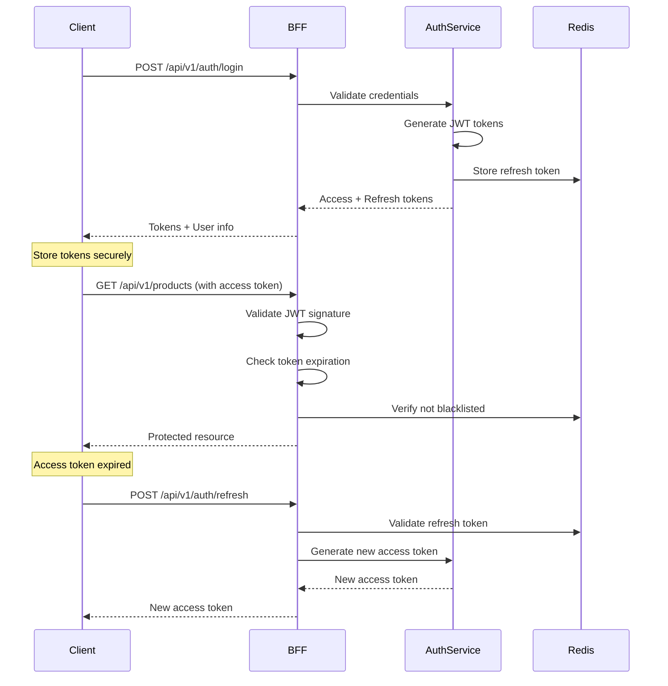

### JWT Token Structure

```typescript
interface AccessToken {
  sub: string;           // User ID
  email: string;
  roles: string[];
  permissions: string[];
  iat: number;           // Issued at
  exp: number;           // Expires at (15 minutes)
}

interface RefreshToken {
  sub: string;           // User ID
  tokenId: string;       // Unique token ID
  iat: number;
  exp: number;           // Expires at (7 days)
}
```

### RBAC Implementation

```typescript
interface Role {
  id: string;
  name: string;
  permissions: Permission[];
}

interface Permission {
  resource: string;      // e.g., "products", "orders"
  actions: string[];     // e.g., ["read", "write", "delete"]
}

// Permission check middleware
function requirePermission(resource: string, action: string) {
  return async (req, res, next) => {
    const user = req.user;
    const hasPermission = user.permissions.some(p => 
      p.resource === resource && p.actions.includes(action)
    );
    
    if (!hasPermission) {
      return res.status(403).json({
        success: false,
        error: {
          code: 'FORBIDDEN',
          message: 'Insufficient permissions'
        }
      });
    }
    
    next();
  };
}

// Usage
router.post('/api/v1/products', 
  authenticate,
  requirePermission('products', 'write'),
  createProduct
);
```

### XSS Protection

```typescript
// Input sanitization
import DOMPurify from 'isomorphic-dompurify';

function sanitizeInput(input: string): string {
  return DOMPurify.sanitize(input, {
    ALLOWED_TAGS: [],
    ALLOWED_ATTR: []
  });
}

// Content Security Policy headers
app.use((req, res, next) => {
  res.setHeader(
    'Content-Security-Policy',
    "default-src 'self'; " +
    "script-src 'self' 'unsafe-inline'; " +
    "style-src 'self' 'unsafe-inline'; " +
    "img-src 'self' data: https:; " +
    "font-src 'self' data:;"
  );
  next();
});
```

### CSRF Protection

```typescript
// CSRF token generation and validation
import csrf from 'csurf';

const csrfProtection = csrf({ 
  cookie: {
    httpOnly: true,
    secure: true,
    sameSite: 'strict'
  }
});

// Apply to state-changing operations
router.post('/api/v1/products', csrfProtection, createProduct);

// Frontend includes CSRF token in requests
axios.defaults.headers.common['X-CSRF-Token'] = csrfToken;
```

### Rate Limiting

```typescript
// Redis-based rate limiting
import rateLimit from 'express-rate-limit';
import RedisStore from 'rate-limit-redis';

const limiter = rateLimit({
  store: new RedisStore({
    client: redisClient,
    prefix: 'rate_limit:'
  }),
  windowMs: 15 * 60 * 1000,  // 15 minutes
  max: 100,                   // Max 100 requests per window
  message: {
    success: false,
    error: {
      code: 'RATE_LIMIT_EXCEEDED',
      message: 'Too many requests, please try again later'
    }
  }
});

// Apply globally or per route
app.use('/api/', limiter);

// Stricter limits for sensitive operations
const strictLimiter = rateLimit({
  windowMs: 15 * 60 * 1000,
  max: 5
});

router.post('/api/v1/auth/login', strictLimiter, login);
```

## Performance & Scalability

### Multi-Layer Caching Strategy

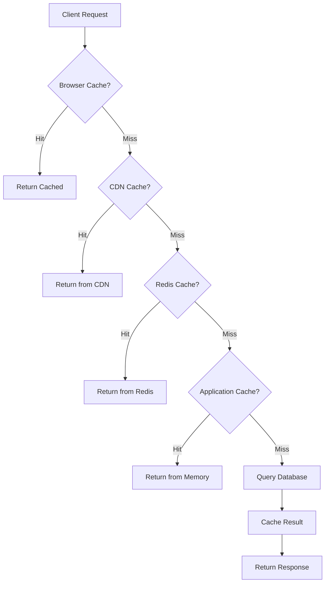

#### Redis Caching Implementation

```typescript
// Cache service with Redis
class CacheService {
  private redis: Redis;
  
  async get<T>(key: string): Promise<T | null> {
    const cached = await this.redis.get(key);
    return cached ? JSON.parse(cached) : null;
  }
  
  async set(key: string, value: any, ttl: number = 3600): Promise<void> {
    await this.redis.setex(key, ttl, JSON.stringify(value));
  }
  
  async invalidate(pattern: string): Promise<void> {
    const keys = await this.redis.keys(pattern);
    if (keys.length > 0) {
      await this.redis.del(...keys);
    }
  }
}

// Usage in product service
async function getProduct(id: string): Promise<Product> {
  const cacheKey = `product:${id}`;
  
  // Try cache first
  const cached = await cacheService.get<Product>(cacheKey);
  if (cached) return cached;
  
  // Query database
  const product = await prisma.product.findUnique({ where: { id } });
  
  // Cache result (1 hour TTL)
  await cacheService.set(cacheKey, product, 3600);
  
  return product;
}

// Invalidate cache on update
async function updateProduct(id: string, data: UpdateProductData): Promise<Product> {
  const product = await prisma.product.update({
    where: { id },
    data
  });
  
  // Invalidate related caches
  await cacheService.invalidate(`product:${id}`);
  await cacheService.invalidate(`products:list:*`);
  
  return product;
}
```

#### Cache Strategies by Resource

| Resource | Strategy | TTL | Invalidation |
|----------|----------|-----|--------------|
| Product details | Cache-aside | 1 hour | On update/delete |
| Product list | Cache-aside | 5 minutes | On any product change |
| User session | Write-through | Session duration | On logout |
| Order details | Cache-aside | 10 minutes | On status change |
| Categories | Cache-aside | 24 hours | On category change |
| Flash sales | Cache-aside | 1 minute | On sale update |

### Database Optimization

#### Indexing Strategy

```sql
-- Product table indexes
CREATE INDEX idx_products_category ON products(category_id);
CREATE INDEX idx_products_brand ON products(brand_id);
CREATE INDEX idx_products_status ON products(status);
CREATE INDEX idx_products_created ON products(created_at DESC);
CREATE INDEX idx_products_price ON products(price);

-- Composite indexes for common queries
CREATE INDEX idx_products_category_status ON products(category_id, status);
CREATE INDEX idx_products_search ON products USING GIN(to_tsvector('english', name || ' ' || description));

-- Order table indexes
CREATE INDEX idx_orders_customer ON orders(customer_id);
CREATE INDEX idx_orders_status ON orders(status);
CREATE INDEX idx_orders_created ON orders(created_at DESC);
CREATE INDEX idx_orders_customer_status ON orders(customer_id, status);

-- Partial indexes for active records
CREATE INDEX idx_active_products ON products(id) WHERE status = 'active';
```

#### Query Optimization

```typescript
// Use select to fetch only needed fields
const products = await prisma.product.findMany({
  select: {
    id: true,
    name: true,
    price: true,
    image: true
  },
  where: { status: 'active' },
  take: 20
});

// Use include for relations instead of separate queries
const order = await prisma.order.findUnique({
  where: { id },
  include: {
    items: {
      include: {
        product: {
          select: { id: true, name: true, image: true }
        }
      }
    },
    customer: {
      select: { id: true, name: true, email: true }
    }
  }
});

// Batch queries to avoid N+1 problem
const orderIds = orders.map(o => o.id);
const orderItems = await prisma.orderItem.findMany({
  where: { orderId: { in: orderIds } }
});
```

#### Database Partitioning

```sql
-- Partition orders table by date
CREATE TABLE orders (
    id UUID PRIMARY KEY,
    created_at TIMESTAMP NOT NULL,
    -- other columns
) PARTITION BY RANGE (created_at);

CREATE TABLE orders_2024_q1 PARTITION OF orders
    FOR VALUES FROM ('2024-01-01') TO ('2024-04-01');

CREATE TABLE orders_2024_q2 PARTITION OF orders
    FOR VALUES FROM ('2024-04-01') TO ('2024-07-01');
```

#### Data Archiving

```typescript
// Archive old orders (older than 2 years)
async function archiveOldOrders() {
  const twoYearsAgo = new Date();
  twoYearsAgo.setFullYear(twoYearsAgo.getFullYear() - 2);
  
  // Move to archive table
  await prisma.$executeRaw`
    INSERT INTO orders_archive
    SELECT * FROM orders
    WHERE created_at < ${twoYearsAgo}
    AND status IN ('delivered', 'cancelled')
  `;
  
  // Delete from main table
  await prisma.order.deleteMany({
    where: {
      createdAt: { lt: twoYearsAgo },
      status: { in: ['delivered', 'cancelled'] }
    }
  });
}
```

### Flash Sale Handling

```typescript
// Flash sale with Redis for high concurrency
class FlashSaleService {
  async purchaseFlashSaleItem(
    saleId: string,
    userId: string,
    quantity: number
  ): Promise<boolean> {
    const stockKey = `flash_sale:${saleId}:stock`;
    const userKey = `flash_sale:${saleId}:user:${userId}`;
    
    // Lua script for atomic stock check and deduction
    const script = `
      local stock = redis.call('GET', KEYS[1])
      local userPurchased = redis.call('GET', KEYS[2])
      local quantity = tonumber(ARGV[1])
      local maxPerUser = tonumber(ARGV[2])
      
      if not stock then
        return -1  -- Sale not found
      end
      
      stock = tonumber(stock)
      userPurchased = tonumber(userPurchased) or 0
      
      if userPurchased + quantity > maxPerUser then
        return -2  -- Exceeds per-user limit
      end
      
      if stock < quantity then
        return -3  -- Insufficient stock
      end
      
      redis.call('DECRBY', KEYS[1], quantity)
      redis.call('INCRBY', KEYS[2], quantity)
      redis.call('EXPIRE', KEYS[2], 86400)
      
      return stock - quantity
    `;
    
    const result = await redis.eval(
      script,
      2,
      stockKey,
      userKey,
      quantity,
      5  // Max 5 per user
    );
    
    if (result >= 0) {
      // Stock reserved, create order asynchronously
      await this.createFlashSaleOrder(saleId, userId, quantity);
      return true;
    }
    
    return false;
  }
}
```

## Monitoring & Observability

### Prometheus Metrics

```typescript
import { Counter, Histogram, Gauge } from 'prom-client';

// Request metrics
const httpRequestDuration = new Histogram({
  name: 'http_request_duration_seconds',
  help: 'Duration of HTTP requests in seconds',
  labelNames: ['method', 'route', 'status_code']
});

const httpRequestTotal = new Counter({
  name: 'http_requests_total',
  help: 'Total number of HTTP requests',
  labelNames: ['method', 'route', 'status_code']
});

// Business metrics
const orderCreated = new Counter({
  name: 'orders_created_total',
  help: 'Total number of orders created',
  labelNames: ['status']
});

const activeUsers = new Gauge({
  name: 'active_users',
  help: 'Number of currently active users'
});

// Middleware to track metrics
app.use((req, res, next) => {
  const start = Date.now();
  
  res.on('finish', () => {
    const duration = (Date.now() - start) / 1000;
    httpRequestDuration
      .labels(req.method, req.route?.path || req.path, res.statusCode.toString())
      .observe(duration);
    httpRequestTotal
      .labels(req.method, req.route?.path || req.path, res.statusCode.toString())
      .inc();
  });
  
  next();
});
```

### Structured Logging

```typescript
import winston from 'winston';

const logger = winston.createLogger({
  format: winston.format.combine(
    winston.format.timestamp(),
    winston.format.errors({ stack: true }),
    winston.format.json()
  ),
  transports: [
    new winston.transports.Console(),
    new winston.transports.File({ filename: 'error.log', level: 'error' }),
    new winston.transports.File({ filename: 'combined.log' })
  ]
});

// Structured log example
logger.info('Order created', {
  orderId: 'ord_123',
  customerId: 'usr_456',
  amount: 99.99,
  items: 3,
  requestId: req.id
});

// Error logging with context
logger.error('Payment processing failed', {
  orderId: 'ord_123',
  error: error.message,
  stack: error.stack,
  paymentMethod: 'credit_card',
  requestId: req.id
});
```

### Distributed Tracing

```typescript
import { trace, context } from '@opentelemetry/api';

// Create spans for distributed tracing
async function processOrder(orderId: string) {
  const tracer = trace.getTracer('order-service');
  
  return tracer.startActiveSpan('processOrder', async (span) => {
    span.setAttribute('order.id', orderId);
    
    try {
      // Child span for inventory check
      await tracer.startActiveSpan('checkInventory', async (childSpan) => {
        const available = await inventoryService.check(orderId);
        childSpan.setAttribute('inventory.available', available);
        childSpan.end();
        return available;
      });
      
      // Child span for payment
      await tracer.startActiveSpan('processPayment', async (childSpan) => {
        const result = await paymentService.process(orderId);
        childSpan.setAttribute('payment.status', result.status);
        childSpan.end();
        return result;
      });
      
      span.setStatus({ code: 0 });
    } catch (error) {
      span.recordException(error);
      span.setStatus({ code: 2, message: error.message });
      throw error;
    } finally {
      span.end();
    }
  });
}
```

## Components and Interfacesx pattern
interface OutboxEvent {
  id: string;
  aggregateType: 'order' | 'product' | 'user';
  aggregateId: string;
  eventType: string;
  payload: any;
  createdAt: Date;
  processed: boolean;
}

// Transaction includes both business data and outbox event
async function createOrder(orderData: CreateOrderData): Promise<Order> {
  return await prisma.$transaction(async (tx) => {
    // 1. Create order
    const order = await tx.order.create({
      data: orderData
    });
    
    // 2. Reserve inventory (write to outbox)
    await tx.outboxEvent.create({
      data: {
        aggregateType: 'order',
        aggregateId: order.id,
        eventType: 'ORDER_CREATED',
        payload: {
          orderId: order.id,
          items: order.items
        }
      }
    });
    
    return order;
  });
}
```

#### Inventory Reserve-Deduct Flow

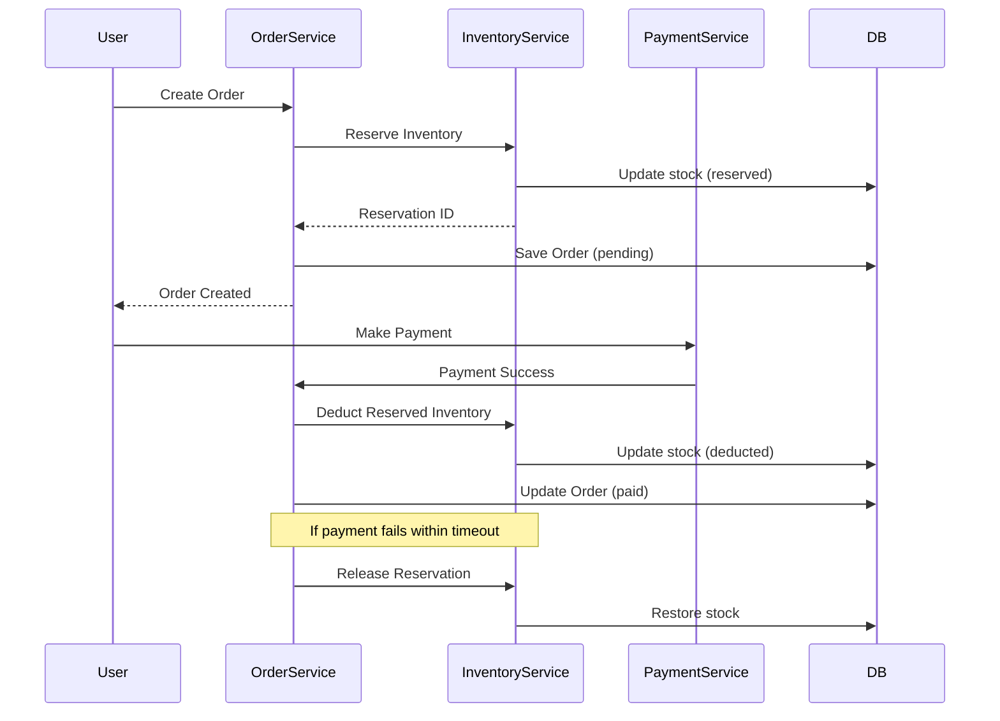

#### Idempotency Implementation

All state-changing operations implement idempotency to handle duplicate requests:

```typescript
interface IdempotencyKey {
  key: string;
  createdAt: Date;
  expiresAt: Date;
  response?: any;
}

// Idempotent order creation
async function createOrderIdempotent(
  idempotencyKey: string,
  orderData: CreateOrderData
): Promise<Order> {
  // Check if request already processed
  const existing = await redis.get(`idempotency:${idempotencyKey}`);
  if (existing) {
    return JSON.parse(existing);
  }
  
  // Process request
  const order = await createOrder(orderData);
  
  // Store result with TTL (24 hours)
  await redis.setex(
    `idempotency:${idempotencyKey}`,
    86400,
    JSON.stringify(order)
  );
  
  return order;
}
```*Data Visualization** | Recharts | Charts and analytics |
| **Icons** | Lucide React + MUI Icons | Icon libraries |
| **BFF/API Gateway** | Node.js + Express | Backend-for-Frontend layer |
| **Database** | PostgreSQL | Primary relational database |
| **Cache** | Redis | Session storage, caching, rate limiting |
| **Search** | Elasticsearch | Full-text search for products |
| **ORM** | Prisma | Type-safe database access |
| **Authentication** | JWT | Token-based authentication |
| **File Storage** | S3-compatible storage | Product images, documents |

### Microservices Architecture

#### Service Decomposition Strategy

Each business domain is implemented as an independent microservice:

1. **Product Service (PMS)**
   - Product CRUD operations
   - Category and brand management
   - Attribute management
   - Product search integration with Elasticsearch
   - Image upload and CDN integration

2. **Order Service (OMS)**
   - Order lifecycle management
   - Payment integration
   - Shipping and logistics integration
   - Return and refund processing
   - Inventory reservation

3. **Marketing Service (SMS)**
   - Flash sale management
   - Coupon generation and validation
   - Recommendation engine
   - Advertisement management

4. **User Service (UMS)**
   - User authentication and authorization
   - Role and permission management
   - Menu and resource access control
   - User profile management

5. **Review Service (RMS)**
   - Review CRUD operations
   - Review moderation
   - Rating aggregation

#### BFF Layer Responsibilities

The Backend-for-Frontend layer provides:

- **API Aggregation**: Combines multiple microservice calls into single frontend requests
- **Authentication**: JWT token validation and refresh
- **Authorization**: Role-based access control enforcement
- **Rate Limiting**: Protects backend services from abuse
- **Request/Response Transformation**: Adapts backend data to frontend needs
- **Caching**: Reduces load on microservices
- **Error Handling**: Unified error response format**API-First Design**: RESTful APIs with OpenAPI specification and contract testing
7. **Security by Design**: Defense in depth with multiple security layers
8. **Performance Optimization**: Sub-2-second page loads, efficient data loading, code splitting
9. **Observability**: Comprehensive logging, metrics, and distributed tracing
10. **Scalability**: Horizontal scaling support with stateless services


## Architecture

### System Architecture Overview

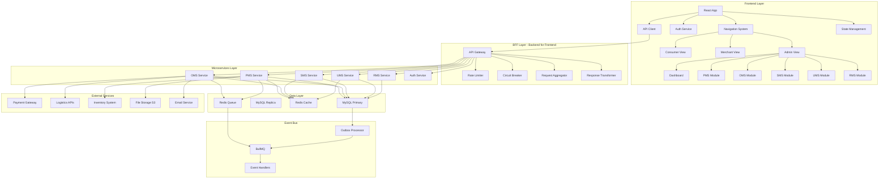

### Microservices Architecture

```mermaid
graph TB
    subgraph "Product Management Service - PMS"
        PMS1[Product Controller]
        PMS2[Category Controller]
        PMS3[Brand Controller]
        PMS4[Attribute Controller]
        PMS5[Product Repository]
        PMS6[Cache Manager]
        PMS7[Event Publisher]
    end
    
    subgraph "Order Management Service - OMS"
        OMS1[Order Controller]
        OMS2[Shipping Controller]
        OMS3[Return Controller]
        OMS4[Order Repository]
        OMS5[State Machine]
        OMS6[Payment Integrator]
        OMS7[Logistics Integrator]
    end
    
    subgraph "Marketing Service - SMS"
        SMS1[Coupon Controller]
        SMS2[Flash Sale Controller]
        SMS3[Recommendation Controller]
        SMS4[Campaign Repository]
        SMS5[Validation Engine]
    end
    
    subgraph "User Management Service - UMS"
        UMS1[User Controller]
        UMS2[Role Controller]
        UMS3[Permission Controller]
        UMS4[User Repository]
        UMS5[RBAC Engine]
        UMS6[Audit Logger]
    end
    
    subgraph "Shared Infrastructure"
        SI1[Redis Cache]
        SI2[Message Queue]
        SI3[Database Pool]
        SI4[Logger]
        SI5[Metrics Collector]
    end
    
    PMS1 --> PMS5
    PMS5 --> SI3
    PMS6 --> SI1
    PMS7 --> SI2
    
    OMS1 --> OMS4
    OMS4 --> SI3
    OMS5 --> SI2
    OMS6 --> SI2
    
    SMS1 --> SMS4
    SMS4 --> SI3
    SMS5 --> SI1
    
    UMS1 --> UMS4
    UMS4 --> SI3
    UMS6 --> SI4
```

### Data Flow Architecture

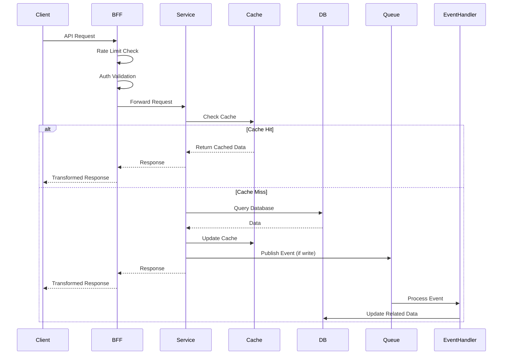

### Caching Strategy

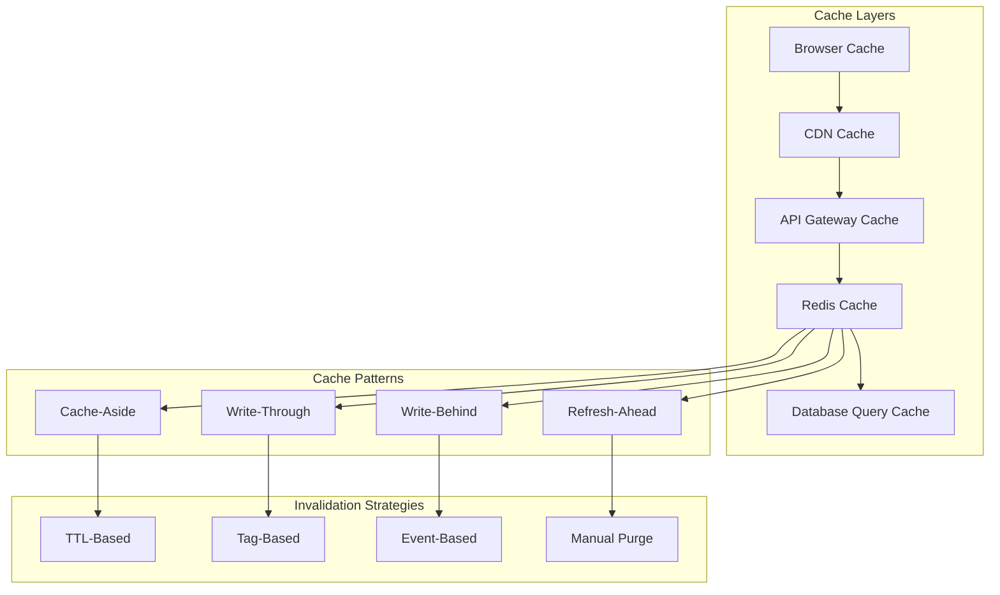

### Data Consistency and Event-Driven Architecture

#### Transactional Outbox Pattern

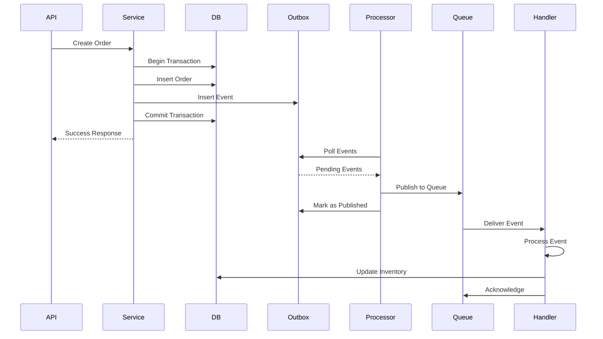

#### Order State Machine

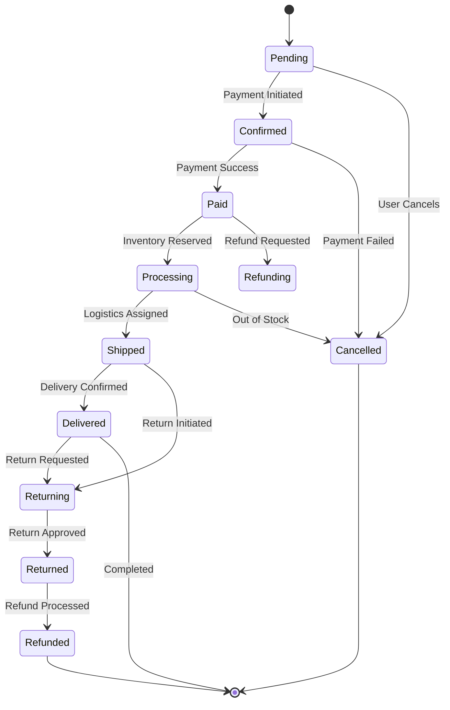

#### Inventory Reserve-Deduct Flow

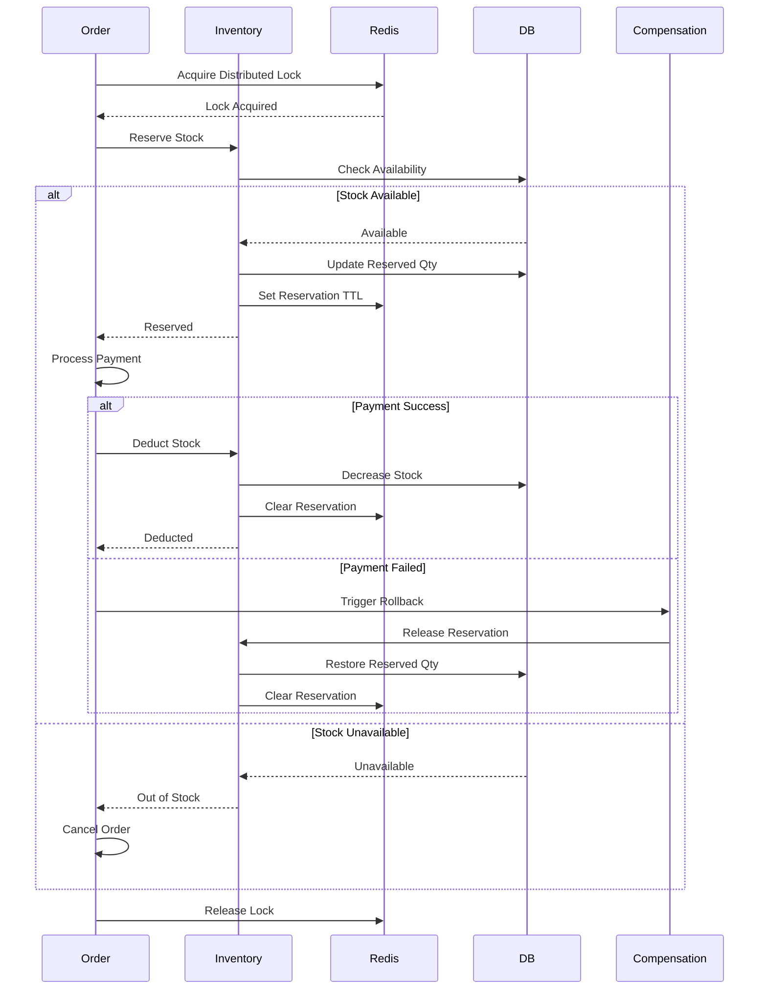

#### Event Types and Handlers

**Core Events:**
- `order.created` → Update inventory, send notification
- `order.paid` → Reserve inventory, trigger fulfillment
- `order.shipped` → Update tracking, notify customer
- `order.delivered` → Update status, request review
- `order.cancelled` → Release inventory, process refund
- `product.created` → Invalidate cache, update search index
- `product.updated` → Invalidate cache, sync inventory
- `inventory.low_stock` → Send alert, trigger reorder
- `user.registered` → Send welcome email, create profile

### Security Architecture

#### Authentication Flow

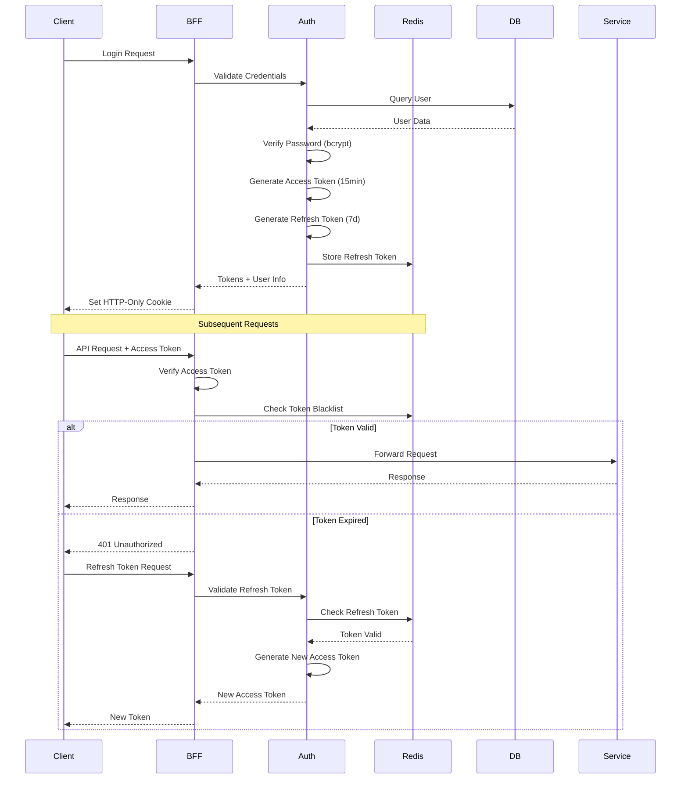

#### RBAC Permission Model

```typescript
interface Permission {
  resource: string;      // e.g., "products", "orders"
  action: string;        // e.g., "read", "write", "delete"
  scope: string;         // e.g., "own", "team", "all"
  conditions?: {         // Optional conditions
    field: string;
    operator: string;
    value: any;
  }[];
}

interface Role {
  id: string;
  name: string;
  permissions: Permission[];
  inherits?: string[];   // Role inheritance
}

// Example Permissions
const permissions = {
  admin: [
    { resource: "*", action: "*", scope: "all" }
  ],
  merchant: [
    { resource: "products", action: "*", scope: "own" },
    { resource: "orders", action: "read", scope: "own" },
    { resource: "orders", action: "update", scope: "own", 
      conditions: [{ field: "status", operator: "in", value: ["pending", "processing"] }]
    }
  ],
  consumer: [
    { resource: "orders", action: "read", scope: "own" },
    { resource: "reviews", action: "*", scope: "own" }
  ]
};
```

#### Security Middleware Stack

```typescript
// Middleware execution order
const securityMiddleware = [
  helmet(),                    // Security headers
  cors(corsOptions),           // CORS configuration
  rateLimiter,                 // Rate limiting
  csrfProtection,              // CSRF tokens
  inputSanitization,           // XSS prevention
  jwtAuthentication,           // JWT validation
  rbacAuthorization,           // Permission check
  idempotencyCheck,            // Duplicate prevention
  auditLogger                  // Audit trail
];
```

#### Rate Limiting Configuration

```typescript
const rateLimitConfig = {
  // Per-user limits
  perUser: {
    windowMs: 60 * 1000,      // 1 minute
    max: 100,                  // 100 requests per minute
    message: 'Too many requests from this user'
  },
  
  // Per-IP limits
  perIP: {
    windowMs: 60 * 1000,      // 1 minute
    max: 1000,                 // 1000 requests per minute
    message: 'Too many requests from this IP'
  },
  
  // Sensitive endpoints
  sensitive: {
    windowMs: 15 * 60 * 1000, // 15 minutes
    max: 5,                    // 5 attempts
    message: 'Too many attempts, please try again later'
  }
};
```


## Components and Interfaces

### Frontend Design System

#### Component Hierarchy
Following atomic design principles:
- **Atoms**: Button, Input, Label, Badge, Avatar
- **Molecules**: FormField, SearchBar, DataTableCell, Card
- **Organisms**: DataTable, ProductForm, OrderDetail, Navigation
- **Templates**: DashboardLayout, ListLayout, DetailLayout
- **Pages**: ProductList, OrderManagement, UserSettings

#### Reusable DataTable Component

```typescript
interface DataTableProps<T> {
  data: T[];
  columns: ColumnDef<T>[];
  pagination?: PaginationConfig;
  sorting?: SortingConfig;
  filtering?: FilteringConfig;
  selection?: SelectionConfig;
  actions?: ActionConfig<T>[];
  loading?: boolean;
  onRowClick?: (row: T) => void;
  onPageChange?: (page: number) => void;
  onSortChange?: (sort: SortConfig) => void;
  onFilterChange?: (filters: FilterState) => void;
}

interface ColumnDef<T> {
  id: string;
  header: string;
  accessorKey?: keyof T;
  accessorFn?: (row: T) => any;
  cell?: (props: CellContext<T>) => React.ReactNode;
  sortable?: boolean;
  filterable?: boolean;
  width?: string | number;
}

// Usage Example
<DataTable
  data={products}
  columns={productColumns}
  pagination={{ page: 1, pageSize: 20, total: 100 }}
  sorting={{ field: 'createdAt', direction: 'desc' }}
  selection={{ mode: 'multiple', selectedIds: [] }}
  actions={[
    { label: 'Edit', icon: Edit, onClick: handleEdit },
    { label: 'Delete', icon: Trash, onClick: handleDelete }
  ]}
  onPageChange={handlePageChange}
/>
```

### Core Infrastructure Components

#### Enhanced API Client

```typescript
interface ApiClient {
  // HTTP Methods
  get<T>(url: string, params?: any, config?: RequestConfig): Promise<ApiResponse<T>>;
  post<T>(url: string, data?: any, config?: RequestConfig): Promise<ApiResponse<T>>;
  put<T>(url: string, data?: any, config?: RequestConfig): Promise<ApiResponse<T>>;
  patch<T>(url: string, data?: any, config?: RequestConfig): Promise<ApiResponse<T>>;
  delete<T>(url: string, config?: RequestConfig): Promise<ApiResponse<T>>;
  
  // File Operations
  upload<T>(url: string, file: File, onProgress?: (progress: number) => void): Promise<ApiResponse<T>>;
  uploadMultiple<T>(url: string, files: File[], onProgress?: (progress: number) => void): Promise<ApiResponse<T>>;
  
  // Batch Operations
  batch<T>(requests: BatchRequest[]): Promise<ApiResponse<T>[]>;
  
  // Request Interceptors
  addRequestInterceptor(interceptor: RequestInterceptor): number;
  removeRequestInterceptor(id: number): void;
  
  // Response Interceptors
  addResponseInterceptor(interceptor: ResponseInterceptor): number;
  removeResponseInterceptor(id: number): void;
}

interface RequestConfig {
  headers?: Record<string, string>;
  timeout?: number;
  retry?: RetryConfig;
  cache?: CacheConfig;
  idempotencyKey?: string;
}

interface RetryConfig {
  maxRetries: number;
  retryDelay: number;
  retryCondition?: (error: any) => boolean;
}

interface CacheConfig {
  ttl: number;
  key?: string;
  tags?: string[];
}

// Implementation with Axios
class ApiClientImpl implements ApiClient {
  private axios: AxiosInstance;
  private cache: CacheManager;
  
  constructor() {
    this.axios = axios.create({
      baseURL: process.env.REACT_APP_API_URL,
      timeout: 30000,
      headers: {
        'Content-Type': 'application/json'
      }
    });
    
    this.setupInterceptors();
  }
  
  private setupInterceptors() {
    // Request interceptor for auth token
    this.axios.interceptors.request.use(
      (config) => {
        const token = authService.getAccessToken();
        if (token) {
          config.headers.Authorization = `Bearer ${token}`;
        }
        return config;
      },
      (error) => Promise.reject(error)
    );
    
    // Response interceptor for token refresh
    this.axios.interceptors.response.use(
      (response) => response,
      async (error) => {
        const originalRequest = error.config;
        
        if (error.response?.status === 401 && !originalRequest._retry) {
          originalRequest._retry = true;
          
          try {
            const newToken = await authService.refreshToken();
            originalRequest.headers.Authorization = `Bearer ${newToken}`;
            return this.axios(originalRequest);
          } catch (refreshError) {
            authService.logout();
            return Promise.reject(refreshError);
          }
        }
        
        return Promise.reject(error);
      }
    );
  }
  
  async get<T>(url: string, params?: any, config?: RequestConfig): Promise<ApiResponse<T>> {
    // Check cache first
    if (config?.cache) {
      const cached = await this.cache.get(config.cache.key || url);
      if (cached) return cached;
    }
    
    const response = await this.axios.get<ApiResponse<T>>(url, { params, ...config });
    
    // Store in cache
    if (config?.cache) {
      await this.cache.set(config.cache.key || url, response.data, config.cache.ttl);
    }
    
    return response.data;
  }
  
  // ... other methods
}
```

#### Enhanced Authentication Service

```typescript
interface AuthService {
  // Authentication
  login(credentials: LoginCredentials): Promise<LoginResponse>;
  logout(): Promise<void>;
  refreshToken(): Promise<string>;
  
  // User Management
  getCurrentUser(): User | null;
  isAuthenticated(): boolean;
  
  // Authorization
  hasPermission(permission: string): boolean;
  hasRole(role: UserRole): boolean;
  hasAnyRole(roles: UserRole[]): boolean;
  hasAllRoles(roles: UserRole[]): boolean;
  
  // Role Switching
  switchRole(role: UserRole): Promise<void>;
  getAvailableRoles(): UserRole[];
  
  // Token Management
  getAccessToken(): string | null;
  getRefreshToken(): string | null;
  setTokens(access: string, refresh: string): void;
  clearTokens(): void;
}

interface LoginCredentials {
  username: string;
  password: string;
  rememberMe?: boolean;
}

interface LoginResponse {
  user: User;
  accessToken: string;
  refreshToken: string;
  expiresIn: number;
}

interface User {
  id: string;
  username: string;
  email: string;
  firstName?: string;
  lastName?: string;
  avatar?: string;
  roles: UserRole[];
  currentRole: UserRole;
  permissions: Permission[];
  status: UserStatus;
}

type UserRole = 'consumer' | 'merchant' | 'admin';
type UserStatus = 'active' | 'inactive' | 'suspended' | 'pending';

// Implementation
class AuthServiceImpl implements AuthService {
  private user: User | null = null;
  private accessToken: string | null = null;
  private refreshToken: string | null = null;
  
  async login(credentials: LoginCredentials): Promise<LoginResponse> {
    const response = await apiClient.post<LoginResponse>('/api/v1/auth/login', credentials);
    
    this.user = response.data.user;
    this.accessToken = response.data.accessToken;
    this.refreshToken = response.data.refreshToken;
    
    // Store in localStorage if rememberMe
    if (credentials.rememberMe) {
      localStorage.setItem('refreshToken', this.refreshToken);
    }
    
    return response.data;
  }
  
  async logout(): Promise<void> {
    try {
      await apiClient.post('/api/v1/auth/logout', {
        refreshToken: this.refreshToken
      });
    } finally {
      this.clearTokens();
      this.user = null;
      localStorage.removeItem('refreshToken');
    }
  }
  
  hasPermission(permission: string): boolean {
    if (!this.user) return false;
    
    // Admin has all permissions
    if (this.user.roles.includes('admin')) return true;
    
    // Check specific permission
    return this.user.permissions.some(p => 
      p.resource === permission.split(':')[0] &&
      p.action === permission.split(':')[1]
    );
  }
  
  // ... other methods
}
```

#### State Management with Zustand

```typescript
// Global Store
interface AppStore {
  // User State
  user: User | null;
  setUser: (user: User | null) => void;
  
  // UI State
  sidebarOpen: boolean;
  toggleSidebar: () => void;
  theme: 'light' | 'dark';
  setTheme: (theme: 'light' | 'dark') => void;
  
  // Notifications
  notifications: Notification[];
  addNotification: (notification: Notification) => void;
  removeNotification: (id: string) => void;
  
  // Loading States
  loading: Record<string, boolean>;
  setLoading: (key: string, loading: boolean) => void;
}

const useAppStore = create<AppStore>((set) => ({
  user: null,
  setUser: (user) => set({ user }),
  
  sidebarOpen: true,
  toggleSidebar: () => set((state) => ({ sidebarOpen: !state.sidebarOpen })),
  
  theme: 'light',
  setTheme: (theme) => set({ theme }),
  
  notifications: [],
  addNotification: (notification) => 
    set((state) => ({ 
      notifications: [...state.notifications, notification] 
    })),
  removeNotification: (id) => 
    set((state) => ({ 
      notifications: state.notifications.filter(n => n.id !== id) 
    })),
  
  loading: {},
  setLoading: (key, loading) => 
    set((state) => ({ 
      loading: { ...state.loading, [key]: loading } 
    }))
}));

// Module-specific stores
interface ProductStore {
  products: Product[];
  selectedProduct: Product | null;
  filters: ProductFilters;
  setProducts: (products: Product[]) => void;
  setSelectedProduct: (product: Product | null) => void;
  setFilters: (filters: ProductFilters) => void;
  fetchProducts: () => Promise<void>;
}

const useProductStore = create<ProductStore>((set, get) => ({
  products: [],
  selectedProduct: null,
  filters: {},
  
  setProducts: (products) => set({ products }),
  setSelectedProduct: (product) => set({ selectedProduct: product }),
  setFilters: (filters) => set({ filters }),
  
  fetchProducts: async () => {
    const { filters } = get();
    const response = await productService.getProducts(filters);
    set({ products: response.items });
  }
}));
```

### Product Management System (PMS) Components

#### Product Service

```typescript
interface ProductService {
  // Product CRUD
  getProducts(params: ProductListParams): Promise<ProductListResponse>;
  getProduct(id: string): Promise<Product>;
  createProduct(data: CreateProductData): Promise<Product>;
  updateProduct(id: string, data: UpdateProductData): Promise<Product>;
  deleteProduct(id: string): Promise<void>;
  
  // Bulk Operations
  bulkUpdateStatus(ids: string[], status: ProductStatus): Promise<void>;
  bulkUpdateCategory(ids: string[], categoryId: string): Promise<void>;
  bulkDelete(ids: string[]): Promise<void>;
  bulkExport(ids: string[], format: 'csv' | 'xlsx'): Promise<Blob>;
  bulkImport(file: File): Promise<ImportResult>;
  
  // Categories
  getCategories(params?: CategoryListParams): Promise<Category[]>;
  getCategory(id: string): Promise<Category>;
  createCategory(data: CreateCategoryData): Promise<Category>;
  updateCategory(id: string, data: UpdateCategoryData): Promise<Category>;
  deleteCategory(id: string): Promise<void>;
  reorderCategories(orders: { id: string; sortOrder: number }[]): Promise<void>;
  
  // Attributes
  getAttributes(params?: AttributeListParams): Promise<Attribute[]>;
  getAttribute(id: string): Promise<Attribute>;
  createAttribute(data: CreateAttributeData): Promise<Attribute>;
  updateAttribute(id: string, data: UpdateAttributeData): Promise<Attribute>;
  deleteAttribute(id: string): Promise<void>;
  
  // Brands
  getBrands(params?: BrandListParams): Promise<Brand[]>;
  getBrand(id: string): Promise<Brand>;
  createBrand(data: CreateBrandData): Promise<Brand>;
  updateBrand(id: string, data: UpdateBrandData): Promise<Brand>;
  deleteBrand(id: string): Promise<void>;
  
  // Inventory
  getInventory(productId: string): Promise<InventoryInfo>;
  updateInventory(productId: string, data: UpdateInventoryData): Promise<InventoryInfo>;
  reserveInventory(productId: string, quantity: number): Promise<ReservationResult>;
  releaseInventory(productId: string, quantity: number): Promise<void>;
}

interface Product {
  id: string;
  name: string;
  description: string;
  shortDescription?: string;
  price: number;
  salePrice?: number;
  sku: string;
  barcode?: string;
  categoryId: string;
  category?: Category;
  brandId: string;
  brand?: Brand;
  attributes: ProductAttribute[];
  images: ProductImage[];
  variants?: ProductVariant[];
  seo: SEOData;
  status: ProductStatus;
  visibility: ProductVisibility;
  inventory: InventoryInfo;
  shipping: ShippingInfo;
  createdAt: Date;
  updatedAt: Date;
  createdBy: string;
  updatedBy: string;
}

type ProductStatus = 'draft' | 'active' | 'inactive' | 'archived';
type ProductVisibility = 'public' | 'private' | 'hidden';

interface ProductListParams {
  page?: number;
  limit?: number;
  search?: string;
  categoryId?: string;
  brandId?: string;
  status?: ProductStatus;
  minPrice?: number;
  maxPrice?: number;
  sortBy?: string;
  sortOrder?: 'asc' | 'desc';
}

interface CreateProductData {
  name: string;
  description: string;
  shortDescription?: string;
  price: number;
  salePrice?: number;
  sku: string;
  barcode?: string;
  categoryId: string;
  brandId: string;
  attributes?: ProductAttribute[];
  images?: File[];
  status?: ProductStatus;
  visibility?: ProductVisibility;
  inventory?: {
    quantity: number;
    lowStockThreshold?: number;
    trackInventory?: boolean;
    allowBackorder?: boolean;
  };
  seo?: SEOData;
}
```

#### Product Components

```typescript
// Product List Component
interface ProductListProps {
  filters: ProductFilters;
  onFiltersChange: (filters: ProductFilters) => void;
  onProductSelect: (product: Product) => void;
  onProductEdit: (product: Product) => void;
  onProductDelete: (product: Product) => void;
}

const ProductList: React.FC<ProductListProps> = ({
  filters,
  onFiltersChange,
  onProductSelect,
  onProductEdit,
  onProductDelete
}) => {
  const [products, setProducts] = useState<Product[]>([]);
  const [loading, setLoading] = useState(false);
  const [pagination, setPagination] = useState<PaginationState>({
    page: 1,
    pageSize: 20,
    total: 0
  });
  
  const columns: ColumnDef<Product>[] = [
    {
      id: 'image',
      header: 'Image',
      cell: ({ row }) => (
        <Avatar>
          <AvatarImage src={row.original.images[0]?.url} />
          <AvatarFallback>{row.original.name[0]}</AvatarFallback>
        </Avatar>
      ),
      width: 60
    },
    {
      id: 'name',
      header: 'Product Name',
      accessorKey: 'name',
      sortable: true,
      filterable: true
    },
    {
      id: 'sku',
      header: 'SKU',
      accessorKey: 'sku',
      sortable: true
    },
    {
      id: 'category',
      header: 'Category',
      accessorFn: (row) => row.category?.name,
      sortable: true
    },
    {
      id: 'price',
      header: 'Price',
      accessorKey: 'price',
      cell: ({ row }) => formatCurrency(row.original.price),
      sortable: true
    },
    {
      id: 'inventory',
      header: 'Stock',
      accessorFn: (row) => row.inventory.quantity,
      cell: ({ row }) => (
        <Badge variant={row.original.inventory.quantity > 0 ? 'success' : 'destructive'}>
          {row.original.inventory.quantity}
        </Badge>
      ),
      sortable: true
    },
    {
      id: 'status',
      header: 'Status',
      accessorKey: 'status',
      cell: ({ row }) => (
        <Badge variant={getStatusVariant(row.original.status)}>
          {row.original.status}
        </Badge>
      ),
      sortable: true
    },
    {
      id: 'actions',
      header: 'Actions',
      cell: ({ row }) => (
        <DropdownMenu>
          <DropdownMenuTrigger asChild>
            <Button variant="ghost" size="sm">
              <MoreHorizontal className="h-4 w-4" />
            </Button>
          </DropdownMenuTrigger>
          <DropdownMenuContent>
            <DropdownMenuItem onClick={() => onProductEdit(row.original)}>
              <Edit className="mr-2 h-4 w-4" />
              Edit
            </DropdownMenuItem>
            <DropdownMenuItem onClick={() => onProductDelete(row.original)}>
              <Trash className="mr-2 h-4 w-4" />
              Delete
            </DropdownMenuItem>
          </DropdownMenuContent>
        </DropdownMenu>
      )
    }
  ];
  
  return (
    <div className="space-y-4">
      <ProductFilters filters={filters} onChange={onFiltersChange} />
      <DataTable
        data={products}
        columns={columns}
        pagination={pagination}
        loading={loading}
        onRowClick={onProductSelect}
        onPageChange={handlePageChange}
      />
    </div>
  );
};

// Product Form Component
interface ProductFormProps {
  product?: Product;
  onSave: (data: ProductFormData) => Promise<void>;
  onCancel: () => void;
}

const ProductForm: React.FC<ProductFormProps> = ({ product, onSave, onCancel }) => {
  const form = useForm<ProductFormData>({
    resolver: zodResolver(productSchema),
    defaultValues: product || {
      name: '',
      description: '',
      price: 0,
      sku: '',
      categoryId: '',
      brandId: '',
      status: 'draft',
      visibility: 'public'
    }
  });
  
  return (
    <Form {...form}>
      <form onSubmit={form.handleSubmit(onSave)} className="space-y-6">
        <FormField
          control={form.control}
          name="name"
          render={({ field }) => (
            <FormItem>
              <FormLabel>Product Name</FormLabel>
              <FormControl>
                <Input {...field} placeholder="Enter product name" />
              </FormControl>
              <FormMessage />
            </FormItem>
          )}
        />
        
        <FormField
          control={form.control}
          name="description"
          render={({ field }) => (
            <FormItem>
              <FormLabel>Description</FormLabel>
              <FormControl>
                <Textarea {...field} placeholder="Enter product description" rows={5} />
              </FormControl>
              <FormMessage />
            </FormItem>
          )}
        />
        
        <div className="grid grid-cols-2 gap-4">
          <FormField
            control={form.control}
            name="price"
            render={({ field }) => (
              <FormItem>
                <FormLabel>Price</FormLabel>
                <FormControl>
                  <Input {...field} type="number" step="0.01" placeholder="0.00" />
                </FormControl>
                <FormMessage />
              </FormItem>
            )}
          />
          
          <FormField
            control={form.control}
            name="salePrice"
            render={({ field }) => (
              <FormItem>
                <FormLabel>Sale Price (Optional)</FormLabel>
                <FormControl>
                  <Input {...field} type="number" step="0.01" placeholder="0.00" />
                </FormControl>
                <FormMessage />
              </FormItem>
            )}
          />
        </div>
        
        {/* More form fields... */}
        
        <div className="flex justify-end space-x-2">
          <Button type="button" variant="outline" onClick={onCancel}>
            Cancel
          </Button>
          <Button type="submit">
            {product ? 'Update' : 'Create'} Product
          </Button>
        </div>
      </form>
    </Form>
  );
};
```


### Order Management System (OMS) Components

#### Order Service

```typescript
interface OrderService {
  // Order CRUD
  getOrders(params: OrderListParams): Promise<OrderListResponse>;
  getOrder(id: string): Promise<Order>;
  updateOrderStatus(id: string, status: OrderStatus, notes?: string): Promise<Order>;
  cancelOrder(id: string, reason: string): Promise<Order>;
  
  // Shipping
  assignTracking(orderId: string, trackingData: TrackingData): Promise<void>;
  updateShippingStatus(orderId: string, status: ShippingStatus): Promise<void>;
  getTrackingInfo(orderId: string): Promise<TrackingInfo>;
  
  // Returns
  getReturns(params: ReturnListParams): Promise<ReturnListResponse>;
  getReturn(id: string): Promise<ReturnRequest>;
  processReturn(returnId: string, action: ReturnAction, notes?: string): Promise<void>;
  
  // Payments
  processRefund(orderId: string, amount: number, reason: string): Promise<RefundResult>;
  getPaymentHistory(orderId: string): Promise<PaymentTransaction[]>;
  
  // Analytics
  getOrderAnalytics(params: AnalyticsParams): Promise<OrderAnalytics>;
  getOrderStats(dateRange: DateRange): Promise<OrderStats>;
  
  // Export
  exportOrders(params: OrderListParams, format: 'csv' | 'xlsx' | 'pdf'): Promise<Blob>;
}

interface Order {
  id: string;
  orderNumber: string;
  customerId: string;
  customerInfo: CustomerInfo;
  items: OrderItem[];
  pricing: OrderPricing;
  status: OrderStatus;
  paymentStatus: PaymentStatus;
  paymentMethod: PaymentMethod;
  shippingInfo: ShippingInfo;
  billingInfo: BillingInfo;
  trackingInfo?: TrackingInfo;
  notes?: string;
  metadata: Record<string, any>;
  createdAt: Date;
  updatedAt: Date;
}

type OrderStatus = 'pending' | 'confirmed' | 'paid' | 'processing' | 'shipped' | 'delivered' | 'cancelled' | 