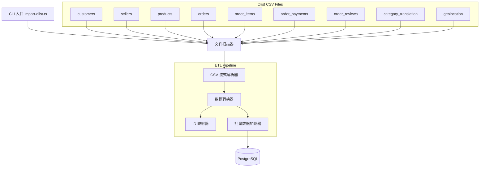
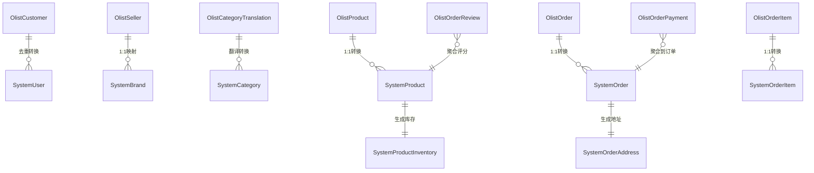

# 设计文档：Olist 数据导入 ETL 工具

## 概述

本设计描述一个独立的 ETL（Extract-Transform-Load）命令行工具，用于将 Kaggle Olist 巴西电商数据集导入商城管理系统的 PostgreSQL 数据库。该工具以流式方式解析 9 个 CSV 文件，将 Olist 数据格式转换为系统现有数据库 schema，并通过批量事务写入数据库。

工具作为独立 TypeScript 脚本运行于 `backend/src/etl/` 目录下，复用现有数据库连接配置，通过 `npm run db:import-olist` 命令执行。

### 设计决策

1. **流式解析而非全量加载**：Olist 数据集约 10 万订单，使用 Node.js stream + csv-parse 库逐行处理，内存占用可控。
2. **分阶段加载顺序**：按外键依赖关系确定加载顺序（用户 → 分类 → 品牌 → 商品 → 库存 → 订单 → 订单项 → 订单地址），确保引用完整性。
3. **内存 ID 映射表**：使用 `Map<string, string>` 在内存中维护 Olist ID 到系统 UUID 的映射，避免频繁查库。数据量级（约 10 万级）在内存中完全可控。
4. **ON CONFLICT 幂等策略**：所有 INSERT 使用 ON CONFLICT DO NOTHING，支持重复执行不报错。
5. **每实体类型独立事务**：每种实体类型的批量插入在独立事务中执行，某类失败不影响其他类型继续加载。

## 架构



### 加载顺序流程


## 组件与接口

### 文件结构

```
backend/src/etl/
├── import-olist.ts          # CLI 入口，协调整个导入流程
├── csv-parser.ts            # CSV 流式解析，输出类型安全对象
├── transformers/
│   ├── customer.ts          # 客户 → 用户转换
│   ├── category.ts          # 分类翻译 → 系统分类转换
│   ├── brand.ts             # 卖家 → 品牌转换
│   ├── product.ts           # 商品转换（含价格计算、评分聚合）
│   ├── inventory.ts         # 库存生成
│   ├── order.ts             # 订单转换（含状态映射、支付信息）
│   ├── order-item.ts        # 订单项转换
│   └── order-address.ts     # 订单地址生成
├── id-mapper.ts             # Olist ID ↔ 系统 UUID 映射管理
├── loader.ts                # 批量数据加载器（事务、批次、ON CONFLICT）
└── types.ts                 # Olist CSV 行类型定义
```


### 核心接口

```typescript
// csv-parser.ts
interface CsvParseOptions {
  filePath: string;
  expectedColumns: string[];
}

function parseCSVStream<T>(options: CsvParseOptions): AsyncIterable<T>;
function scanDataDirectory(dirPath: string): Map<string, string>; // filename → fullPath

// id-mapper.ts
class IdMapper {
  set(namespace: string, olistId: string, systemUuid: string): void;
  get(namespace: string, olistId: string): string | undefined;
  getOrThrow(namespace: string, olistId: string): string;
  size(namespace: string): number;
}

// loader.ts
interface LoadResult {
  entityType: string;
  inserted: number;
  skipped: number;
  failed: number;
  duration: number;
}

function batchInsert(
  client: PoolClient,
  table: string,
  columns: string[],
  rows: any[][],
  conflictTarget?: string
): Promise<number>;

// transformers 通用模式
interface TransformContext {
  idMapper: IdMapper;
  olistData: OlistDatasets;  // 所有已解析的 CSV 数据
}
```

### Olist 状态到系统状态映射

| Olist 状态 | 系统订单状态 |
|---|---|
| delivered | delivered |
| shipped | shipped |
| canceled | cancelled |
| created | pending |
| approved | confirmed |
| invoiced | paid |
| processing | processing |
| unavailable | cancelled |

### 支付方式映射

| Olist 支付方式 | 系统支付方式 |
|---|---|
| credit_card | credit_card |
| boleto | bank_transfer |
| debit_card | credit_card |
| voucher | cash |
| not_defined | bank_transfer |

## 数据模型

### Olist CSV 原始数据类型

```typescript
// types.ts - Olist CSV 行类型

interface OlistCustomer {
  customer_id: string;
  customer_unique_id: string;
  customer_zip_code_prefix: string;
  customer_city: string;
  customer_state: string;
}

interface OlistSeller {
  seller_id: string;
  seller_zip_code_prefix: string;
  seller_city: string;
  seller_state: string;
}

interface OlistProduct {
  product_id: string;
  product_category_name: string;
  product_name_lenght: string;      // Olist 原始拼写
  product_description_lenght: string;
  product_photos_qty: string;
  product_weight_g: string;
  product_length_cm: string;
  product_height_cm: string;
  product_width_cm: string;
}

interface OlistOrder {
  order_id: string;
  customer_id: string;
  order_status: string;
  order_purchase_timestamp: string;
  order_approved_at: string;
  order_delivered_carrier_date: string;
  order_delivered_customer_date: string;
  order_estimated_delivery_date: string;
}

interface OlistOrderItem {
  order_id: string;
  order_item_id: string;
  product_id: string;
  seller_id: string;
  shipping_limit_date: string;
  price: string;
  freight_value: string;
}

interface OlistOrderPayment {
  order_id: string;
  payment_sequential: string;
  payment_type: string;
  payment_installments: string;
  payment_value: string;
}

interface OlistOrderReview {
  review_id: string;
  order_id: string;
  review_score: string;
  review_comment_title: string;
  review_comment_message: string;
  review_creation_date: string;
  review_answer_timestamp: string;
}

interface OlistCategoryTranslation {
  product_category_name: string;           // 葡萄牙语
  product_category_name_english: string;   // 英语
}
```

### 转换映射关系



### 关键转换规则

**用户名生成**: `customer_{customer_unique_id.substring(0, 8)}`
**邮箱生成**: `customer_{customer_unique_id.substring(0, 8)}@olist.demo`
**品牌名生成**: `Seller_{seller_id.substring(0, 8)}`
**SKU 生成**: `OLIST-{product_id.substring(0, 8).toUpperCase()}`
**订单号生成**: `ORD-{YYYYMMDD from purchase_timestamp}-{order_id.substring(0, 6)}`
**地址生成**: `Rua {zip_code_prefix}, {city}`
**电话生成**: `55{zip_code_prefix}0000`
**商品价格**: 该商品所有订单项价格的中位数
**库存量**: `sales_count * 2 + 50`
**重量转换**: `product_weight_g / 1000`（克 → 千克）

