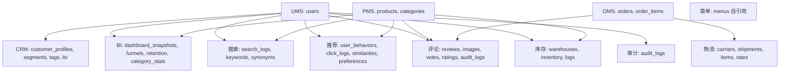

# 设计文档：数据库扩展优化

## 概述

本设计将商城管理系统数据库从 29 张表扩展到约 60 张表，新增 9 个业务模块共 31 张表。所有新表遵循现有设计规范：UUID 主键（`gen_random_uuid()`）、`TIMESTAMP WITH TIME ZONE` 时间戳、`IF NOT EXISTS` 幂等创建、外键约束、`update_updated_at_column()` 触发器、`COMMENT` 注释。

迁移脚本按模块拆分为 7 个独立文件（007-013），按依赖顺序执行。

### 现有表清单（29 张）

| 模块 | 表名 | 数量 |
|------|------|------|
| UMS | users, roles, permissions, user_roles, role_permissions | 5 |
| PMS | categories, brands, attributes, products, product_attributes, product_images, product_inventory, product_seo | 8 |
| OMS | orders, order_items, order_addresses, order_tracking, tracking_updates, return_requests, return_items | 7 |
| SMS | flash_sales, flash_sale_products, coupons, coupon_usage, recommendations, recommendation_products, advertisements | 7 |
| 其他 | outbox_events, stock_reservations | 2 |

### 新增表清单（31 张）

| 模块 | 表名 | 数量 |
|------|------|------|
| CRM | customer_profiles, customer_segments, customer_segment_members, customer_tags, customer_tag_assignments, customer_lifetime_values | 6 |
| BI | dashboard_snapshots, traffic_funnels, user_retention_reports, category_sales_stats | 4 |
| 搜索 | search_logs, search_keywords, search_synonyms | 3 |
| 推荐增强 | user_behaviors, click_logs, product_similarities, user_preferences | 4 |
| 评论 | reviews, review_images, review_votes, product_ratings, review_audit_logs | 5 |
| 物流增强 | carriers, shipments, shipment_items, shipping_rate_rules | 4 |
| 库存增强 | warehouses, warehouse_inventory, inventory_logs | 3 |
| 审计 | audit_logs | 1 |
| 菜单 | menus | 1 |

## 架构

### 迁移文件规划

```
backend/src/database/migrations/
├── 001_create_users_tables.sql          (现有 - UMS)
├── 002_create_outbox_events_table.sql   (现有)
├── 003_create_pms_tables.sql            (现有 - PMS)
├── 004_create_oms_tables.sql            (现有 - OMS)
├── 005_create_sms_tables.sql            (现有 - SMS)
├── 006_create_stock_reservations.sql    (现有)
├── 007_create_crm_tables.sql            (新增 - CRM 6张)
├── 008_create_bi_tables.sql             (新增 - BI 4张)
├── 009_create_search_tables.sql         (新增 - 搜索 3张)
├── 010_create_recommendation_tables.sql (新增 - 推荐增强 4张)
├── 011_create_review_tables.sql         (新增 - 评论 5张)
├── 012_create_logistics_tables.sql      (新增 - 物流增强 4张)
├── 013_create_warehouse_audit_menu.sql  (新增 - 库存增强3张 + 审计1张 + 菜单1张)
```

### 依赖关系



### 设计原则

1. **幂等性**：所有 DDL 使用 `IF NOT EXISTS`，迁移可重复执行
2. **一致性**：UUID 主键、`TIMESTAMP WITH TIME ZONE`、`update_updated_at_column()` 触发器
3. **性能**：外键字段必建索引、高频查询场景建复合索引、部分索引优化
4. **数据集兼容**：字段类型使用 `TEXT` 而非固定长度 `VARCHAR`（需要灵活性的字段），兼容 Kaggle 数据集导入
5. **注释完备**：所有表和关键字段添加 `COMMENT`


## 组件与接口

### 迁移脚本 007: CRM 客户管理系统（6 张表）

依赖：`users` 表（001）

#### customer_profiles - 客户画像

```sql
CREATE TABLE IF NOT EXISTS customer_profiles (
  id UUID PRIMARY KEY DEFAULT gen_random_uuid(),
  user_id UUID NOT NULL REFERENCES users(id) ON DELETE CASCADE,
  gender VARCHAR(20),
  birth_date DATE,
  income_level VARCHAR(50),       -- 兼容 Kaggle Customer Personality Analysis
  education VARCHAR(100),          -- 兼容 Kaggle: Graduation, PhD, Master, etc.
  marital_status VARCHAR(50),      -- 兼容 Kaggle: Single, Together, Married, etc.
  registration_source VARCHAR(100),
  first_order_at TIMESTAMP WITH TIME ZONE,
  last_order_at TIMESTAMP WITH TIME ZONE,
  total_orders INTEGER NOT NULL DEFAULT 0,
  total_spent DECIMAL(12, 2) NOT NULL DEFAULT 0,
  created_at TIMESTAMP WITH TIME ZONE NOT NULL DEFAULT CURRENT_TIMESTAMP,
  updated_at TIMESTAMP WITH TIME ZONE NOT NULL DEFAULT CURRENT_TIMESTAMP,
  CONSTRAINT uq_customer_profiles_user_id UNIQUE (user_id)
);
```

索引：`user_id`（唯一约束自带）、`registration_source`、`last_order_at`

#### customer_segments - 客户分群

```sql
CREATE TABLE IF NOT EXISTS customer_segments (
  id UUID PRIMARY KEY DEFAULT gen_random_uuid(),
  name VARCHAR(255) NOT NULL,
  slug VARCHAR(255) NOT NULL,
  description TEXT,
  rules JSONB,                     -- 分群规则 JSON
  customer_count INTEGER NOT NULL DEFAULT 0,
  is_active BOOLEAN NOT NULL DEFAULT TRUE,
  created_at TIMESTAMP WITH TIME ZONE NOT NULL DEFAULT CURRENT_TIMESTAMP,
  updated_at TIMESTAMP WITH TIME ZONE NOT NULL DEFAULT CURRENT_TIMESTAMP,
  CONSTRAINT uq_customer_segments_name UNIQUE (name),
  CONSTRAINT uq_customer_segments_slug UNIQUE (slug)
);
```

#### customer_segment_members - 分群成员

```sql
CREATE TABLE IF NOT EXISTS customer_segment_members (
  id UUID PRIMARY KEY DEFAULT gen_random_uuid(),
  segment_id UUID NOT NULL REFERENCES customer_segments(id) ON DELETE CASCADE,
  user_id UUID NOT NULL REFERENCES users(id) ON DELETE CASCADE,
  created_at TIMESTAMP WITH TIME ZONE NOT NULL DEFAULT CURRENT_TIMESTAMP,
  CONSTRAINT uq_segment_members UNIQUE (segment_id, user_id)
);
```

索引：`segment_id`、`user_id`

#### customer_tags - 客户标签

```sql
CREATE TABLE IF NOT EXISTS customer_tags (
  id UUID PRIMARY KEY DEFAULT gen_random_uuid(),
  name VARCHAR(100) NOT NULL,
  color VARCHAR(20),
  description TEXT,
  created_at TIMESTAMP WITH TIME ZONE NOT NULL DEFAULT CURRENT_TIMESTAMP,
  updated_at TIMESTAMP WITH TIME ZONE NOT NULL DEFAULT CURRENT_TIMESTAMP,
  CONSTRAINT uq_customer_tags_name UNIQUE (name)
);
```

#### customer_tag_assignments - 标签分配

```sql
CREATE TABLE IF NOT EXISTS customer_tag_assignments (
  id UUID PRIMARY KEY DEFAULT gen_random_uuid(),
  tag_id UUID NOT NULL REFERENCES customer_tags(id) ON DELETE CASCADE,
  user_id UUID NOT NULL REFERENCES users(id) ON DELETE CASCADE,
  created_at TIMESTAMP WITH TIME ZONE NOT NULL DEFAULT CURRENT_TIMESTAMP,
  CONSTRAINT uq_tag_assignments UNIQUE (tag_id, user_id)
);
```

索引：`tag_id`、`user_id`

#### customer_lifetime_values - 客户生命周期价值

```sql
CREATE TABLE IF NOT EXISTS customer_lifetime_values (
  id UUID PRIMARY KEY DEFAULT gen_random_uuid(),
  user_id UUID NOT NULL REFERENCES users(id) ON DELETE CASCADE,
  rfm_recency_score INTEGER,       -- R 分值
  rfm_frequency_score INTEGER,     -- F 分值
  rfm_monetary_score INTEGER,      -- M 分值
  rfm_segment VARCHAR(50),         -- RFM 分群标签
  ltv_predicted DECIMAL(12, 2),    -- 预测 LTV
  ltv_actual DECIMAL(12, 2),       -- 实际 LTV
  churn_probability DECIMAL(5, 4), -- 流失概率 0-1
  last_calculated_at TIMESTAMP WITH TIME ZONE,
  created_at TIMESTAMP WITH TIME ZONE NOT NULL DEFAULT CURRENT_TIMESTAMP,
  updated_at TIMESTAMP WITH TIME ZONE NOT NULL DEFAULT CURRENT_TIMESTAMP,
  CONSTRAINT uq_clv_user_id UNIQUE (user_id)
);
```

索引：`rfm_segment`、`churn_probability`

### 迁移脚本 008: BI 分析系统（4 张表）

依赖：`categories` 表（003）

#### dashboard_snapshots - 仪表盘快照

```sql
CREATE TABLE IF NOT EXISTS dashboard_snapshots (
  id UUID PRIMARY KEY DEFAULT gen_random_uuid(),
  snapshot_date DATE NOT NULL,
  period_type VARCHAR(20) NOT NULL CHECK (period_type IN ('daily', 'weekly', 'monthly')),
  gmv DECIMAL(14, 2),
  order_count INTEGER,
  avg_order_value DECIMAL(10, 2),
  new_user_count INTEGER,
  active_user_count INTEGER,
  repurchase_rate DECIMAL(5, 4),
  conversion_rate DECIMAL(5, 4),
  refund_rate DECIMAL(5, 4),
  created_at TIMESTAMP WITH TIME ZONE NOT NULL DEFAULT CURRENT_TIMESTAMP,
  CONSTRAINT uq_dashboard_snapshot UNIQUE (snapshot_date, period_type)
);
```

索引：`snapshot_date`、`(snapshot_date, period_type)`（唯一约束自带）

#### traffic_funnels - 流量漏斗

```sql
CREATE TABLE IF NOT EXISTS traffic_funnels (
  id UUID PRIMARY KEY DEFAULT gen_random_uuid(),
  snapshot_date DATE NOT NULL,
  period_type VARCHAR(20) NOT NULL CHECK (period_type IN ('daily', 'weekly', 'monthly')),
  stage VARCHAR(30) NOT NULL CHECK (stage IN (
    'visit', 'search', 'product_view', 'add_to_cart', 'checkout', 'payment', 'completed'
  )),
  user_count INTEGER NOT NULL DEFAULT 0,
  conversion_rate_to_next DECIMAL(5, 4),
  created_at TIMESTAMP WITH TIME ZONE NOT NULL DEFAULT CURRENT_TIMESTAMP,
  CONSTRAINT uq_traffic_funnel UNIQUE (snapshot_date, period_type, stage)
);
```

#### user_retention_reports - 用户留存报告

```sql
CREATE TABLE IF NOT EXISTS user_retention_reports (
  id UUID PRIMARY KEY DEFAULT gen_random_uuid(),
  cohort_date DATE NOT NULL,
  period_type VARCHAR(20) NOT NULL CHECK (period_type IN ('daily', 'weekly', 'monthly')),
  period_offset INTEGER NOT NULL,  -- 第 N 个周期
  cohort_size INTEGER NOT NULL,
  retained_count INTEGER NOT NULL,
  retention_rate DECIMAL(5, 4),
  created_at TIMESTAMP WITH TIME ZONE NOT NULL DEFAULT CURRENT_TIMESTAMP,
  CONSTRAINT uq_retention_report UNIQUE (cohort_date, period_type, period_offset)
);
```

#### category_sales_stats - 品类销售统计

```sql
CREATE TABLE IF NOT EXISTS category_sales_stats (
  id UUID PRIMARY KEY DEFAULT gen_random_uuid(),
  category_id UUID NOT NULL REFERENCES categories(id) ON DELETE CASCADE,
  snapshot_date DATE NOT NULL,
  period_type VARCHAR(20) NOT NULL CHECK (period_type IN ('daily', 'weekly', 'monthly')),
  sales_amount DECIMAL(14, 2) NOT NULL DEFAULT 0,
  order_count INTEGER NOT NULL DEFAULT 0,
  product_count INTEGER NOT NULL DEFAULT 0,
  avg_price DECIMAL(10, 2),
  created_at TIMESTAMP WITH TIME ZONE NOT NULL DEFAULT CURRENT_TIMESTAMP,
  CONSTRAINT uq_category_sales UNIQUE (category_id, snapshot_date, period_type)
);
```

索引：`category_id`、`snapshot_date`、`(category_id, snapshot_date, period_type)`

### 迁移脚本 009: 搜索系统（3 张表）

依赖：`users`（001）、`products`（003）

#### search_logs - 搜索日志

```sql
CREATE TABLE IF NOT EXISTS search_logs (
  id UUID PRIMARY KEY DEFAULT gen_random_uuid(),
  user_id UUID REFERENCES users(id) ON DELETE SET NULL,
  keyword TEXT NOT NULL,
  result_count INTEGER NOT NULL DEFAULT 0,
  clicked_product_id UUID REFERENCES products(id) ON DELETE SET NULL,
  session_id VARCHAR(100),
  ip_address VARCHAR(45),
  user_agent TEXT,
  searched_at TIMESTAMP WITH TIME ZONE NOT NULL DEFAULT CURRENT_TIMESTAMP,
  created_at TIMESTAMP WITH TIME ZONE NOT NULL DEFAULT CURRENT_TIMESTAMP
);
```

索引：`keyword`、`searched_at`、`user_id`、`clicked_product_id`、`session_id`

#### search_keywords - 关键词聚合统计

```sql
CREATE TABLE IF NOT EXISTS search_keywords (
  id UUID PRIMARY KEY DEFAULT gen_random_uuid(),
  keyword TEXT NOT NULL,
  search_count INTEGER NOT NULL DEFAULT 0,
  click_count INTEGER NOT NULL DEFAULT 0,
  conversion_count INTEGER NOT NULL DEFAULT 0,
  avg_result_count DECIMAL(10, 2),
  last_searched_at TIMESTAMP WITH TIME ZONE,
  created_at TIMESTAMP WITH TIME ZONE NOT NULL DEFAULT CURRENT_TIMESTAMP,
  updated_at TIMESTAMP WITH TIME ZONE NOT NULL DEFAULT CURRENT_TIMESTAMP,
  CONSTRAINT uq_search_keywords_keyword UNIQUE (keyword)
);
```

索引：`search_count DESC`

#### search_synonyms - 搜索同义词

```sql
CREATE TABLE IF NOT EXISTS search_synonyms (
  id UUID PRIMARY KEY DEFAULT gen_random_uuid(),
  keyword TEXT NOT NULL,
  synonym TEXT NOT NULL,
  is_active BOOLEAN NOT NULL DEFAULT TRUE,
  created_at TIMESTAMP WITH TIME ZONE NOT NULL DEFAULT CURRENT_TIMESTAMP,
  updated_at TIMESTAMP WITH TIME ZONE NOT NULL DEFAULT CURRENT_TIMESTAMP,
  CONSTRAINT uq_search_synonyms UNIQUE (keyword, synonym)
);
```

索引：`keyword`、`is_active`


### 迁移脚本 010: 推荐系统增强（4 张表）

依赖：`users`（001）、`products`（003）

#### user_behaviors - 用户行为记录

```sql
CREATE TABLE IF NOT EXISTS user_behaviors (
  id UUID PRIMARY KEY DEFAULT gen_random_uuid(),
  user_id UUID NOT NULL REFERENCES users(id) ON DELETE CASCADE,
  product_id UUID NOT NULL REFERENCES products(id) ON DELETE CASCADE,
  behavior_type VARCHAR(20) NOT NULL CHECK (behavior_type IN (
    'view', 'click', 'add_to_cart', 'purchase', 'favorite', 'share'
  )),
  session_id VARCHAR(100),
  referrer_url TEXT,
  duration_seconds INTEGER,
  occurred_at TIMESTAMP WITH TIME ZONE NOT NULL DEFAULT CURRENT_TIMESTAMP,
  created_at TIMESTAMP WITH TIME ZONE NOT NULL DEFAULT CURRENT_TIMESTAMP
);
```

索引：`(user_id, behavior_type)`、`occurred_at`、`product_id`、`session_id`

设计说明：`behavior_type` 枚举兼容 RetailRocket 数据集的 view/addtocart/transaction 事件类型映射。

#### click_logs - 点击日志

```sql
CREATE TABLE IF NOT EXISTS click_logs (
  id UUID PRIMARY KEY DEFAULT gen_random_uuid(),
  user_id UUID REFERENCES users(id) ON DELETE SET NULL,
  product_id UUID NOT NULL REFERENCES products(id) ON DELETE CASCADE,
  source_page VARCHAR(100),
  source_module VARCHAR(100),
  position INTEGER,
  session_id VARCHAR(100),
  ip_address VARCHAR(45),
  clicked_at TIMESTAMP WITH TIME ZONE NOT NULL DEFAULT CURRENT_TIMESTAMP,
  created_at TIMESTAMP WITH TIME ZONE NOT NULL DEFAULT CURRENT_TIMESTAMP
);
```

索引：`(product_id, clicked_at)`、`user_id`、`session_id`

#### product_similarities - 商品相似度

```sql
CREATE TABLE IF NOT EXISTS product_similarities (
  id UUID PRIMARY KEY DEFAULT gen_random_uuid(),
  product_id UUID NOT NULL REFERENCES products(id) ON DELETE CASCADE,
  similar_product_id UUID NOT NULL REFERENCES products(id) ON DELETE CASCADE,
  similarity_score DECIMAL(5, 4) NOT NULL CHECK (similarity_score >= 0 AND similarity_score <= 1),
  algorithm VARCHAR(100) NOT NULL,
  calculated_at TIMESTAMP WITH TIME ZONE NOT NULL DEFAULT CURRENT_TIMESTAMP,
  created_at TIMESTAMP WITH TIME ZONE NOT NULL DEFAULT CURRENT_TIMESTAMP,
  CONSTRAINT uq_product_similarity UNIQUE (product_id, similar_product_id),
  CONSTRAINT chk_no_self_similarity CHECK (product_id != similar_product_id)
);
```

索引：`product_id`、`similar_product_id`、`(product_id, similarity_score DESC)`

设计说明：支持存储基于 Instacart 数据集计算的协同过滤结果，`algorithm` 字段记录计算方法（如 `cosine_cf`、`item_based_cf`）。

#### user_preferences - 用户偏好

```sql
CREATE TABLE IF NOT EXISTS user_preferences (
  id UUID PRIMARY KEY DEFAULT gen_random_uuid(),
  user_id UUID NOT NULL REFERENCES users(id) ON DELETE CASCADE,
  preferred_categories UUID[],     -- UUID 数组
  preferred_brands UUID[],         -- UUID 数组
  price_range_min DECIMAL(10, 2),
  price_range_max DECIMAL(10, 2),
  updated_at TIMESTAMP WITH TIME ZONE NOT NULL DEFAULT CURRENT_TIMESTAMP,
  created_at TIMESTAMP WITH TIME ZONE NOT NULL DEFAULT CURRENT_TIMESTAMP,
  CONSTRAINT uq_user_preferences_user_id UNIQUE (user_id)
);
```

索引：`user_id`（唯一约束自带）

### 迁移脚本 011: 评论系统（5 张表）

依赖：`users`（001）、`products`（003）、`orders`（004）

#### reviews - 商品评论

```sql
CREATE TABLE IF NOT EXISTS reviews (
  id UUID PRIMARY KEY DEFAULT gen_random_uuid(),
  product_id UUID NOT NULL REFERENCES products(id) ON DELETE CASCADE,
  user_id UUID NOT NULL REFERENCES users(id) ON DELETE CASCADE,
  order_id UUID REFERENCES orders(id) ON DELETE SET NULL,
  rating INTEGER NOT NULL CHECK (rating >= 1 AND rating <= 5),
  title VARCHAR(500),
  content TEXT,                    -- 兼容 Amazon Reviews 数据集
  status VARCHAR(20) NOT NULL DEFAULT 'pending' CHECK (status IN (
    'pending', 'approved', 'rejected', 'hidden'
  )),
  is_verified_purchase BOOLEAN NOT NULL DEFAULT FALSE,
  is_deleted BOOLEAN NOT NULL DEFAULT FALSE,
  created_at TIMESTAMP WITH TIME ZONE NOT NULL DEFAULT CURRENT_TIMESTAMP,
  updated_at TIMESTAMP WITH TIME ZONE NOT NULL DEFAULT CURRENT_TIMESTAMP
);
```

索引：`(product_id, status)`、`user_id`、`order_id`、`rating`、`created_at`
部分唯一索引：`UNIQUE (user_id, product_id) WHERE is_deleted = FALSE`

#### review_images - 评论图片

```sql
CREATE TABLE IF NOT EXISTS review_images (
  id UUID PRIMARY KEY DEFAULT gen_random_uuid(),
  review_id UUID NOT NULL REFERENCES reviews(id) ON DELETE CASCADE,
  image_url TEXT NOT NULL,
  thumbnail_url TEXT,
  original_filename VARCHAR(255),
  file_size INTEGER,
  mime_type VARCHAR(100),
  display_order INTEGER NOT NULL DEFAULT 0,
  created_at TIMESTAMP WITH TIME ZONE NOT NULL DEFAULT CURRENT_TIMESTAMP
);
```

索引：`review_id`、`(review_id, display_order)`

#### review_votes - 评论投票

```sql
CREATE TABLE IF NOT EXISTS review_votes (
  id UUID PRIMARY KEY DEFAULT gen_random_uuid(),
  review_id UUID NOT NULL REFERENCES reviews(id) ON DELETE CASCADE,
  user_id UUID NOT NULL REFERENCES users(id) ON DELETE CASCADE,
  vote_type VARCHAR(20) NOT NULL CHECK (vote_type IN ('useful', 'not_useful')),
  created_at TIMESTAMP WITH TIME ZONE NOT NULL DEFAULT CURRENT_TIMESTAMP,
  CONSTRAINT uq_review_votes UNIQUE (user_id, review_id)
);
```

索引：`review_id`、`user_id`

#### product_ratings - 商品评分聚合

```sql
CREATE TABLE IF NOT EXISTS product_ratings (
  id UUID PRIMARY KEY DEFAULT gen_random_uuid(),
  product_id UUID NOT NULL REFERENCES products(id) ON DELETE CASCADE,
  average_rating DECIMAL(3, 2) NOT NULL DEFAULT 0,
  total_reviews INTEGER NOT NULL DEFAULT 0,
  rating_1_count INTEGER NOT NULL DEFAULT 0,
  rating_2_count INTEGER NOT NULL DEFAULT 0,
  rating_3_count INTEGER NOT NULL DEFAULT 0,
  rating_4_count INTEGER NOT NULL DEFAULT 0,
  rating_5_count INTEGER NOT NULL DEFAULT 0,
  created_at TIMESTAMP WITH TIME ZONE NOT NULL DEFAULT CURRENT_TIMESTAMP,
  updated_at TIMESTAMP WITH TIME ZONE NOT NULL DEFAULT CURRENT_TIMESTAMP,
  CONSTRAINT uq_product_ratings_product_id UNIQUE (product_id)
);
```

#### review_audit_logs - 评论审计日志

```sql
CREATE TABLE IF NOT EXISTS review_audit_logs (
  id UUID PRIMARY KEY DEFAULT gen_random_uuid(),
  review_id UUID NOT NULL REFERENCES reviews(id) ON DELETE CASCADE,
  user_id UUID NOT NULL REFERENCES users(id) ON DELETE SET NULL,
  action VARCHAR(20) NOT NULL CHECK (action IN (
    'create', 'update', 'delete', 'approve', 'reject', 'vote'
  )),
  old_data JSONB,
  new_data JSONB,
  ip_address VARCHAR(45),
  created_at TIMESTAMP WITH TIME ZONE NOT NULL DEFAULT CURRENT_TIMESTAMP
);
```

索引：`review_id`、`user_id`、`action`、`created_at`

### 迁移脚本 012: 物流系统增强（4 张表）

依赖：`orders`（004）、`order_items`（004）

#### carriers - 承运商

```sql
CREATE TABLE IF NOT EXISTS carriers (
  id UUID PRIMARY KEY DEFAULT gen_random_uuid(),
  name VARCHAR(255) NOT NULL,
  code VARCHAR(50) NOT NULL,
  logo_url TEXT,
  tracking_url_template TEXT,      -- 如 https://track.example.com/{tracking_number}
  contact_phone VARCHAR(50),
  contact_email VARCHAR(255),
  is_active BOOLEAN NOT NULL DEFAULT TRUE,
  priority INTEGER NOT NULL DEFAULT 0,
  created_at TIMESTAMP WITH TIME ZONE NOT NULL DEFAULT CURRENT_TIMESTAMP,
  updated_at TIMESTAMP WITH TIME ZONE NOT NULL DEFAULT CURRENT_TIMESTAMP,
  CONSTRAINT uq_carriers_name UNIQUE (name),
  CONSTRAINT uq_carriers_code UNIQUE (code)
);
```

#### shipments - 发货单

```sql
CREATE TABLE IF NOT EXISTS shipments (
  id UUID PRIMARY KEY DEFAULT gen_random_uuid(),
  order_id UUID NOT NULL REFERENCES orders(id) ON DELETE RESTRICT,
  carrier_id UUID NOT NULL REFERENCES carriers(id) ON DELETE RESTRICT,
  shipment_number VARCHAR(100) NOT NULL,
  status VARCHAR(30) NOT NULL DEFAULT 'pending' CHECK (status IN (
    'pending', 'picked_up', 'in_transit', 'out_for_delivery', 'delivered', 'failed', 'returned'
  )),
  weight DECIMAL(10, 2),
  shipping_cost DECIMAL(10, 2),
  estimated_delivery_at TIMESTAMP WITH TIME ZONE,
  actual_delivery_at TIMESTAMP WITH TIME ZONE,
  shipped_at TIMESTAMP WITH TIME ZONE,
  created_at TIMESTAMP WITH TIME ZONE NOT NULL DEFAULT CURRENT_TIMESTAMP,
  updated_at TIMESTAMP WITH TIME ZONE NOT NULL DEFAULT CURRENT_TIMESTAMP,
  CONSTRAINT uq_shipments_number UNIQUE (shipment_number)
);
```

索引：`order_id`、`carrier_id`、`(order_id, status)`、`shipped_at`、`actual_delivery_at`

#### shipment_items - 发货单明细

```sql
CREATE TABLE IF NOT EXISTS shipment_items (
  id UUID PRIMARY KEY DEFAULT gen_random_uuid(),
  shipment_id UUID NOT NULL REFERENCES shipments(id) ON DELETE CASCADE,
  order_item_id UUID NOT NULL REFERENCES order_items(id) ON DELETE RESTRICT,
  quantity INTEGER NOT NULL CHECK (quantity > 0),
  created_at TIMESTAMP WITH TIME ZONE NOT NULL DEFAULT CURRENT_TIMESTAMP,
  CONSTRAINT uq_shipment_items UNIQUE (shipment_id, order_item_id)
);
```

索引：`shipment_id`、`order_item_id`

#### shipping_rate_rules - 运费规则

```sql
CREATE TABLE IF NOT EXISTS shipping_rate_rules (
  id UUID PRIMARY KEY DEFAULT gen_random_uuid(),
  carrier_id UUID NOT NULL REFERENCES carriers(id) ON DELETE CASCADE,
  region VARCHAR(100),
  min_weight DECIMAL(10, 2),
  max_weight DECIMAL(10, 2),
  base_cost DECIMAL(10, 2) NOT NULL,
  per_kg_cost DECIMAL(10, 2) NOT NULL DEFAULT 0,
  estimated_days INTEGER,
  is_active BOOLEAN NOT NULL DEFAULT TRUE,
  created_at TIMESTAMP WITH TIME ZONE NOT NULL DEFAULT CURRENT_TIMESTAMP,
  updated_at TIMESTAMP WITH TIME ZONE NOT NULL DEFAULT CURRENT_TIMESTAMP
);
```

索引：`carrier_id`、`(carrier_id, region, is_active)`

### 迁移脚本 013: 库存增强 + 审计日志 + 菜单系统（5 张表）

依赖：`users`（001）、`products`（003）

#### warehouses - 仓库

```sql
CREATE TABLE IF NOT EXISTS warehouses (
  id UUID PRIMARY KEY DEFAULT gen_random_uuid(),
  name VARCHAR(255) NOT NULL,
  code VARCHAR(50) NOT NULL,
  address TEXT,
  city VARCHAR(100),
  state VARCHAR(100),
  postal_code VARCHAR(20),
  country VARCHAR(100) DEFAULT 'China',
  contact_name VARCHAR(255),
  contact_phone VARCHAR(50),
  is_active BOOLEAN NOT NULL DEFAULT TRUE,
  priority INTEGER NOT NULL DEFAULT 0,
  created_at TIMESTAMP WITH TIME ZONE NOT NULL DEFAULT CURRENT_TIMESTAMP,
  updated_at TIMESTAMP WITH TIME ZONE NOT NULL DEFAULT CURRENT_TIMESTAMP,
  CONSTRAINT uq_warehouses_name UNIQUE (name),
  CONSTRAINT uq_warehouses_code UNIQUE (code)
);
```

#### warehouse_inventory - 仓库库存

```sql
CREATE TABLE IF NOT EXISTS warehouse_inventory (
  id UUID PRIMARY KEY DEFAULT gen_random_uuid(),
  warehouse_id UUID NOT NULL REFERENCES warehouses(id) ON DELETE CASCADE,
  product_id UUID NOT NULL REFERENCES products(id) ON DELETE CASCADE,
  quantity INTEGER NOT NULL DEFAULT 0 CHECK (quantity >= 0),
  reserved_quantity INTEGER NOT NULL DEFAULT 0 CHECK (reserved_quantity >= 0),
  low_stock_threshold INTEGER DEFAULT 10,
  created_at TIMESTAMP WITH TIME ZONE NOT NULL DEFAULT CURRENT_TIMESTAMP,
  updated_at TIMESTAMP WITH TIME ZONE NOT NULL DEFAULT CURRENT_TIMESTAMP,
  CONSTRAINT uq_warehouse_inventory UNIQUE (warehouse_id, product_id)
);
```

索引：`warehouse_id`、`product_id`

#### inventory_logs - 库存流水

```sql
CREATE TABLE IF NOT EXISTS inventory_logs (
  id UUID PRIMARY KEY DEFAULT gen_random_uuid(),
  product_id UUID NOT NULL REFERENCES products(id) ON DELETE CASCADE,
  warehouse_id UUID REFERENCES warehouses(id) ON DELETE SET NULL,
  type VARCHAR(20) NOT NULL CHECK (type IN (
    'inbound', 'outbound', 'adjustment', 'transfer', 'reservation', 'release'
  )),
  quantity_change INTEGER NOT NULL,
  quantity_before INTEGER NOT NULL,
  quantity_after INTEGER NOT NULL CHECK (quantity_after >= 0),
  reference_type VARCHAR(50),      -- order, return, manual, transfer
  reference_id UUID,
  operator_id UUID REFERENCES users(id) ON DELETE SET NULL,
  remark TEXT,
  created_at TIMESTAMP WITH TIME ZONE NOT NULL DEFAULT CURRENT_TIMESTAMP
);
```

索引：`(product_id, created_at)`、`(warehouse_id, created_at)`、`reference_type`、`operator_id`

#### audit_logs - 系统审计日志

```sql
CREATE TABLE IF NOT EXISTS audit_logs (
  id UUID PRIMARY KEY DEFAULT gen_random_uuid(),
  user_id UUID REFERENCES users(id) ON DELETE SET NULL,
  action VARCHAR(50) NOT NULL,
  resource VARCHAR(100) NOT NULL,
  resource_id UUID,
  details JSONB,
  ip_address VARCHAR(45),
  user_agent TEXT,
  request_id VARCHAR(100),
  created_at TIMESTAMP WITH TIME ZONE NOT NULL DEFAULT CURRENT_TIMESTAMP
);
```

索引：`(resource, resource_id)`、`(user_id, created_at)`、`created_at`、`action`

#### menus - 菜单

```sql
CREATE TABLE IF NOT EXISTS menus (
  id UUID PRIMARY KEY DEFAULT gen_random_uuid(),
  name VARCHAR(100) NOT NULL,
  path VARCHAR(255),
  icon VARCHAR(100),
  parent_id UUID REFERENCES menus(id) ON DELETE CASCADE,
  sort_order INTEGER NOT NULL DEFAULT 0,
  permission_key VARCHAR(100),
  is_active BOOLEAN NOT NULL DEFAULT TRUE,
  menu_type VARCHAR(20) NOT NULL DEFAULT 'menu' CHECK (menu_type IN (
    'directory', 'menu', 'button'
  )),
  created_at TIMESTAMP WITH TIME ZONE NOT NULL DEFAULT CURRENT_TIMESTAMP,
  updated_at TIMESTAMP WITH TIME ZONE NOT NULL DEFAULT CURRENT_TIMESTAMP
);
```

索引：`parent_id`、`(parent_id, sort_order)`、`permission_key`


## 数据模型

### ER 关系图

```mermaid
erDiagram
    %% === CRM 模块 ===
    users ||--o| customer_profiles : "1:1"
    users ||--o| customer_lifetime_values : "1:1"
    users ||--o{ customer_segment_members : "1:N"
    users ||--o{ customer_tag_assignments : "1:N"
    customer_segments ||--o{ customer_segment_members : "1:N"
    customer_tags ||--o{ customer_tag_assignments : "1:N"

    %% === BI 模块 ===
    categories ||--o{ category_sales_stats : "1:N"

    %% === 搜索模块 ===
    users ||--o{ search_logs : "1:N"
    products ||--o{ search_logs : "1:N clicked"

    %% === 推荐模块 ===
    users ||--o{ user_behaviors : "1:N"
    products ||--o{ user_behaviors : "1:N"
    users ||--o{ click_logs : "1:N"
    products ||--o{ click_logs : "1:N"
    products ||--o{ product_similarities : "1:N source"
    products ||--o{ product_similarities : "1:N similar"
    users ||--o| user_preferences : "1:1"

    %% === 评论模块 ===
    users ||--o{ reviews : "1:N"
    products ||--o{ reviews : "1:N"
    orders ||--o{ reviews : "1:N"
    reviews ||--o{ review_images : "1:N"
    reviews ||--o{ review_votes : "1:N"
    users ||--o{ review_votes : "1:N"
    products ||--o| product_ratings : "1:1"
    reviews ||--o{ review_audit_logs : "1:N"

    %% === 物流模块 ===
    orders ||--o{ shipments : "1:N"
    carriers ||--o{ shipments : "1:N"
    shipments ||--o{ shipment_items : "1:N"
    order_items ||--o{ shipment_items : "1:N"
    carriers ||--o{ shipping_rate_rules : "1:N"

    %% === 库存模块 ===
    warehouses ||--o{ warehouse_inventory : "1:N"
    products ||--o{ warehouse_inventory : "1:N"
    products ||--o{ inventory_logs : "1:N"
    warehouses ||--o{ inventory_logs : "1:N"
    users ||--o{ inventory_logs : "1:N operator"

    %% === 审计模块 ===
    users ||--o{ audit_logs : "1:N"

    %% === 菜单模块 ===
    menus ||--o{ menus : "自引用 parent"
```



### 索引策略总览

| 索引类型 | 使用场景 | 示例 |
|---------|---------|------|
| 唯一索引 | 业务唯一约束 | `customer_profiles.user_id`、`carriers.code` |
| 联合唯一索引 | 多字段唯一 | `(segment_id, user_id)`、`(warehouse_id, product_id)` |
| 部分唯一索引 | 条件唯一 | `reviews (user_id, product_id) WHERE is_deleted = FALSE` |
| 复合索引 | 高频查询优化 | `(product_id, status)`、`(user_id, behavior_type)` |
| 降序索引 | 排序查询 | `search_keywords.search_count DESC` |
| 时间索引 | 范围查询 | `snapshot_date`、`searched_at`、`occurred_at` |
| 外键索引 | JOIN 优化 | 所有外键字段 |

### 触发器策略

所有包含 `updated_at` 字段的新表均配置 `update_updated_at_column()` 触发器，复用 001 迁移中已创建的函数。

涉及的表：`customer_profiles`、`customer_segments`、`customer_tags`、`customer_lifetime_values`、`search_keywords`、`search_synonyms`、`user_preferences`、`reviews`、`product_ratings`、`carriers`、`shipments`、`shipping_rate_rules`、`warehouses`、`warehouse_inventory`、`menus`

不需要触发器的表（仅有 `created_at`，数据写入后不修改）：`customer_segment_members`、`customer_tag_assignments`、`dashboard_snapshots`、`traffic_funnels`、`user_retention_reports`、`category_sales_stats`、`search_logs`、`user_behaviors`、`click_logs`、`review_images`、`review_votes`、`review_audit_logs`、`shipment_items`、`inventory_logs`、`audit_logs`

### 表数量验证

| 模块 | 现有 | 新增 | 合计 |
|------|------|------|------|
| UMS | 5 | 0 | 5 |
| PMS | 8 | 0 | 8 |
| OMS | 7 | 0 | 7 |
| SMS | 7 | 0 | 7 |
| CRM | 0 | 6 | 6 |
| BI | 0 | 4 | 4 |
| 搜索 | 0 | 3 | 3 |
| 推荐增强 | 0 | 4 | 4 |
| 评论 | 0 | 5 | 5 |
| 物流增强 | 0 | 4 | 4 |
| 库存增强 | 0 | 3 | 3 |
| 审计 | 0 | 1 | 1 |
| 菜单 | 0 | 1 | 1 |
| 其他 | 2 | 0 | 2 |
| **总计** | **29** | **31** | **60** |

