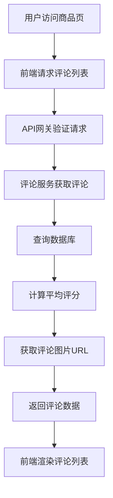
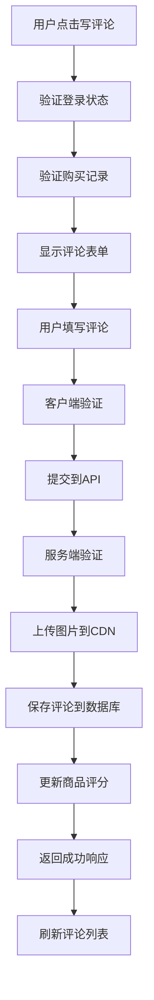
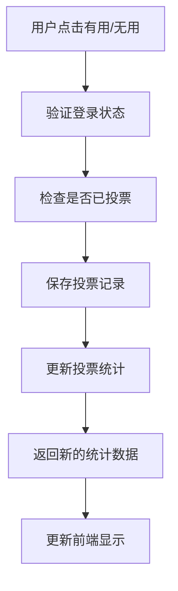

# 用户评论系统设计文档

## 1. 系统架构概述

### 1.1 整体架构
用户评论系统采用分层架构设计，包含以下主要层次：

```
┌─────────────────────────────────────────────────────────────┐
│                    前端展示层 (Frontend)                      │
│  ┌─────────────────┐  ┌─────────────────┐  ┌─────────────────┐ │
│  │   商品详情页     │  │   评论表单组件   │  │   评论列表组件   │ │
│  └─────────────────┘  └─────────────────┘  └─────────────────┘ │
└─────────────────────────────────────────────────────────────┘
                                │
                                ▼
┌─────────────────────────────────────────────────────────────┐
│                    API网关层 (API Gateway)                   │
│              身份验证 │ 请求路由 │ 限流控制                    │
└─────────────────────────────────────────────────────────────┘
                                │
                                ▼
┌─────────────────────────────────────────────────────────────┐
│                   业务逻辑层 (Business Logic)                │
│  ┌─────────────────┐  ┌─────────────────┐  ┌─────────────────┐ │
│  │   评论服务       │  │   图片服务       │  │   投票服务       │ │
│  │  ReviewService  │  │  ImageService   │  │  VoteService    │ │
│  └─────────────────┘  └─────────────────┘  └─────────────────┘ │
└─────────────────────────────────────────────────────────────┘
                                │
                                ▼
┌─────────────────────────────────────────────────────────────┐
│                    数据访问层 (Data Access)                  │
│  ┌─────────────────┐  ┌─────────────────┐  ┌─────────────────┐ │
│  │   评论仓储       │  │   用户仓储       │  │   商品仓储       │ │
│  │ ReviewRepository│  │ UserRepository  │  │ProductRepository│ │
│  └─────────────────┘  └─────────────────┘  └─────────────────┘ │
└─────────────────────────────────────────────────────────────┘
                                │
                                ▼
┌─────────────────────────────────────────────────────────────┐
│                     数据存储层 (Data Storage)                │
│  ┌─────────────────┐  ┌─────────────────┐  ┌─────────────────┐ │
│  │   关系数据库     │  │      CDN        │  │     缓存        │ │
│  │   PostgreSQL    │  │   图片存储       │  │     Redis       │ │
│  └─────────────────┘  └─────────────────┘  └─────────────────┘ │
└─────────────────────────────────────────────────────────────┘
```

### 1.2 核心组件

#### 1.2.1 评论服务 (ReviewService)
- 负责评论的CRUD操作
- 评分计算和统计
- 评论权限验证
- 敏感词过滤

#### 1.2.2 图片服务 (ImageService)  
- 图片上传处理
- 图片格式验证
- CDN存储管理
- 缩略图生成

#### 1.2.3 投票服务 (VoteService)
- 评论有用性投票
- 投票统计计算
- 防重复投票

## 2. 数据流图

### 2.1 评论查看流程


### 2.2 评论提交流程


### 2.3 评论投票流程


## 3. 数据库设计

### 3.1 数据库Schema

#### 3.1.1 评论表 (reviews)
```sql
CREATE TABLE reviews (
    id BIGSERIAL PRIMARY KEY,
    product_id BIGINT NOT NULL,
    user_id BIGINT NOT NULL,
    rating INTEGER NOT NULL CHECK (rating >= 1 AND rating <= 5),
    content TEXT NOT NULL CHECK (LENGTH(content) >= 10 AND LENGTH(content) <= 500),
    status VARCHAR(20) DEFAULT 'active' CHECK (status IN ('active', 'deleted')),
    created_at TIMESTAMP WITH TIME ZONE DEFAULT CURRENT_TIMESTAMP,
    updated_at TIMESTAMP WITH TIME ZONE DEFAULT CURRENT_TIMESTAMP,
    deleted_at TIMESTAMP WITH TIME ZONE NULL,
    
    -- 索引
    CONSTRAINT reviews_product_user_unique UNIQUE (product_id, user_id),
    FOREIGN KEY (product_id) REFERENCES products(id),
    FOREIGN KEY (user_id) REFERENCES users(id)
);

-- 创建索引
CREATE INDEX idx_reviews_product_id ON reviews(product_id);
CREATE INDEX idx_reviews_user_id ON reviews(user_id);
CREATE INDEX idx_reviews_created_at ON reviews(created_at DESC);
CREATE INDEX idx_reviews_rating ON reviews(rating);
CREATE INDEX idx_reviews_status ON reviews(status);
```

#### 3.1.2 评论图片表 (review_images)
```sql
CREATE TABLE review_images (
    id BIGSERIAL PRIMARY KEY,
    review_id BIGINT NOT NULL,
    image_url VARCHAR(500) NOT NULL,
    thumbnail_url VARCHAR(500),
    original_filename VARCHAR(255),
    file_size INTEGER,
    mime_type VARCHAR(50),
    display_order INTEGER DEFAULT 0,
    created_at TIMESTAMP WITH TIME ZONE DEFAULT CURRENT_TIMESTAMP,
    
    FOREIGN KEY (review_id) REFERENCES reviews(id) ON DELETE CASCADE
);

-- 创建索引
CREATE INDEX idx_review_images_review_id ON review_images(review_id);
CREATE INDEX idx_review_images_order ON review_images(review_id, display_order);
```

#### 3.1.3 评论投票表 (review_votes)
```sql
CREATE TABLE review_votes (
    id BIGSERIAL PRIMARY KEY,
    review_id BIGINT NOT NULL,
    user_id BIGINT NOT NULL,
    vote_type VARCHAR(20) NOT NULL CHECK (vote_type IN ('useful', 'not_useful')),
    created_at TIMESTAMP WITH TIME ZONE DEFAULT CURRENT_TIMESTAMP,
    
    CONSTRAINT review_votes_unique UNIQUE (review_id, user_id),
    FOREIGN KEY (review_id) REFERENCES reviews(id) ON DELETE CASCADE,
    FOREIGN KEY (user_id) REFERENCES users(id)
);

-- 创建索引
CREATE INDEX idx_review_votes_review_id ON review_votes(review_id);
CREATE INDEX idx_review_votes_user_id ON review_votes(user_id);
```

#### 3.1.4 商品评分统计表 (product_rating_stats)
```sql
CREATE TABLE product_rating_stats (
    product_id BIGINT PRIMARY KEY,
    total_reviews INTEGER DEFAULT 0,
    average_rating DECIMAL(3,1) DEFAULT 0.0,
    rating_1_count INTEGER DEFAULT 0,
    rating_2_count INTEGER DEFAULT 0,
    rating_3_count INTEGER DEFAULT 0,
    rating_4_count INTEGER DEFAULT 0,
    rating_5_count INTEGER DEFAULT 0,
    updated_at TIMESTAMP WITH TIME ZONE DEFAULT CURRENT_TIMESTAMP,
    
    FOREIGN KEY (product_id) REFERENCES products(id)
);

-- 创建索引
CREATE INDEX idx_product_rating_stats_average ON product_rating_stats(average_rating DESC);
```

### 3.2 数据库触发器

#### 3.2.1 评分统计更新触发器
```sql
-- 创建更新评分统计的函数
CREATE OR REPLACE FUNCTION update_product_rating_stats()
RETURNS TRIGGER AS $$
BEGIN
    -- 插入或更新商品评分统计
    INSERT INTO product_rating_stats (product_id, total_reviews, average_rating, 
                                    rating_1_count, rating_2_count, rating_3_count, 
                                    rating_4_count, rating_5_count, updated_at)
    SELECT 
        product_id,
        COUNT(*) as total_reviews,
        ROUND(AVG(rating::DECIMAL), 1) as average_rating,
        COUNT(CASE WHEN rating = 1 THEN 1 END) as rating_1_count,
        COUNT(CASE WHEN rating = 2 THEN 1 END) as rating_2_count,
        COUNT(CASE WHEN rating = 3 THEN 1 END) as rating_3_count,
        COUNT(CASE WHEN rating = 4 THEN 1 END) as rating_4_count,
        COUNT(CASE WHEN rating = 5 THEN 1 END) as rating_5_count,
        CURRENT_TIMESTAMP
    FROM reviews 
    WHERE product_id = COALESCE(NEW.product_id, OLD.product_id) 
      AND status = 'active'
    GROUP BY product_id
    ON CONFLICT (product_id) 
    DO UPDATE SET
        total_reviews = EXCLUDED.total_reviews,
        average_rating = EXCLUDED.average_rating,
        rating_1_count = EXCLUDED.rating_1_count,
        rating_2_count = EXCLUDED.rating_2_count,
        rating_3_count = EXCLUDED.rating_3_count,
        rating_4_count = EXCLUDED.rating_4_count,
        rating_5_count = EXCLUDED.rating_5_count,
        updated_at = EXCLUDED.updated_at;
    
    RETURN COALESCE(NEW, OLD);
END;
$$ LANGUAGE plpgsql;

-- 创建触发器
CREATE TRIGGER trigger_update_product_rating_stats
    AFTER INSERT OR UPDATE OR DELETE ON reviews
    FOR EACH ROW
    EXECUTE FUNCTION update_product_rating_stats();
```

## 4. API设计

### 4.1 API端点概览

| 方法 | 端点 | 描述 | 认证 |
|------|------|------|------|
| GET | `/api/reviews` | 获取评论列表 | 否 |
| POST | `/api/reviews` | 创建评论 | 是 |
| PUT | `/api/reviews/{id}` | 更新评论 | 是 |
| DELETE | `/api/reviews/{id}` | 删除评论 | 是 |
| POST | `/api/reviews/{id}/images` | 上传评论图片 | 是 |
| POST | `/api/reviews/{id}/vote` | 评论投票 | 是 |
| GET | `/api/products/{id}/rating-stats` | 获取商品评分统计 | 否 |

### 4.2 详细API规范

#### 4.2.1 获取评论列表
```http
GET /api/reviews?productId={productId}&page={page}&limit={limit}&sortBy={sortBy}&order={order}
```

**请求参数:**
- `productId` (必填): 商品ID
- `page` (可选): 页码，默认1
- `limit` (可选): 每页数量，默认10，最大50
- `sortBy` (可选): 排序字段 (`created_at`, `rating`, `useful_votes`)，默认`created_at`
- `order` (可选): 排序方向 (`asc`, `desc`)，默认`desc`

**响应示例:**
```json
{
  "success": true,
  "data": {
    "reviews": [
      {
        "id": 1,
        "productId": 123,
        "userId": 456,
        "username": "张**",
        "rating": 5,
        "content": "商品质量很好，物流也很快，推荐购买！",
        "images": [
          {
            "id": 1,
            "url": "https://cdn.example.com/images/review1_1.jpg",
            "thumbnailUrl": "https://cdn.example.com/images/review1_1_thumb.jpg"
          }
        ],
        "usefulVotes": 15,
        "notUsefulVotes": 2,
        "userVote": null,
        "createdAt": "2024-01-15T10:30:00Z",
        "updatedAt": "2024-01-15T10:30:00Z"
      }
    ],
    "pagination": {
      "page": 1,
      "limit": 10,
      "total": 156,
      "totalPages": 16
    },
    "stats": {
      "averageRating": 4.3,
      "totalReviews": 156,
      "ratingDistribution": {
        "1": 5,
        "2": 8,
        "3": 23,
        "4": 45,
        "5": 75
      }
    }
  }
}
```

#### 4.2.2 创建评论
```http
POST /api/reviews
Content-Type: application/json
Authorization: Bearer {token}
```

**请求体:**
```json
{
  "productId": 123,
  "rating": 5,
  "content": "商品质量很好，物流也很快，推荐购买！"
}
```

**响应示例:**
```json
{
  "success": true,
  "data": {
    "id": 1,
    "productId": 123,
    "userId": 456,
    "rating": 5,
    "content": "商品质量很好，物流也很快，推荐购买！",
    "status": "active",
    "createdAt": "2024-01-15T10:30:00Z",
    "updatedAt": "2024-01-15T10:30:00Z"
  }
}
```

**错误响应:**
```json
{
  "success": false,
  "error": {
    "code": "VALIDATION_ERROR",
    "message": "评论内容长度必须在10-500字符之间",
    "details": {
      "field": "content",
      "value": "太短",
      "constraint": "长度必须在10-500字符之间"
    }
  }
}
```

#### 4.2.3 更新评论
```http
PUT /api/reviews/{id}
Content-Type: application/json
Authorization: Bearer {token}
```

**请求体:**
```json
{
  "rating": 4,
  "content": "更新后的评论内容，商品还是不错的。"
}
```

#### 4.2.4 删除评论
```http
DELETE /api/reviews/{id}
Authorization: Bearer {token}
```

**响应示例:**
```json
{
  "success": true,
  "message": "评论已删除"
}
```

#### 4.2.5 上传评论图片
```http
POST /api/reviews/{id}/images
Content-Type: multipart/form-data
Authorization: Bearer {token}
```

**请求参数:**
- `images`: 图片文件数组，最多5张

**响应示例:**
```json
{
  "success": true,
  "data": {
    "images": [
      {
        "id": 1,
        "url": "https://cdn.example.com/images/review1_1.jpg",
        "thumbnailUrl": "https://cdn.example.com/images/review1_1_thumb.jpg",
        "originalFilename": "product_photo.jpg",
        "fileSize": 1024000
      }
    ]
  }
}
```

#### 4.2.6 评论投票
```http
POST /api/reviews/{id}/vote
Content-Type: application/json
Authorization: Bearer {token}
```

**请求体:**
```json
{
  "voteType": "useful"
}
```

**响应示例:**
```json
{
  "success": true,
  "data": {
    "usefulVotes": 16,
    "notUsefulVotes": 2,
    "userVote": "useful"
  }
}
```

### 4.3 错误码定义

| 错误码 | HTTP状态码 | 描述 |
|--------|------------|------|
| VALIDATION_ERROR | 400 | 请求参数验证失败 |
| UNAUTHORIZED | 401 | 未登录或token无效 |
| FORBIDDEN | 403 | 无权限执行操作 |
| NOT_FOUND | 404 | 资源不存在 |
| DUPLICATE_REVIEW | 409 | 用户已对该商品评论过 |
| NOT_PURCHASED | 422 | 用户未购买该商品 |
| REVIEW_EDIT_EXPIRED | 422 | 评论编辑时间已过期 |
| IMAGE_UPLOAD_ERROR | 422 | 图片上传失败 |
| RATE_LIMIT_EXCEEDED | 429 | 请求频率超限 |
| INTERNAL_ERROR | 500 | 服务器内部错误 |

## 5. 组件设计

### 5.1 前端组件架构

#### 5.1.1 评论列表组件 (ReviewList)
```typescript
interface ReviewListProps {
  productId: number;
  sortBy?: 'created_at' | 'rating' | 'useful_votes';
  order?: 'asc' | 'desc';
}

interface ReviewListState {
  reviews: Review[];
  loading: boolean;
  pagination: Pagination;
  stats: RatingStats;
}
```

**主要功能:**
- 评论数据获取和展示
- 分页加载
- 排序切换
- 评分统计展示

#### 5.1.2 评论表单组件 (ReviewForm)
```typescript
interface ReviewFormProps {
  productId: number;
  onSubmit: (review: ReviewFormData) => void;
  onCancel: () => void;
}

interface ReviewFormData {
  rating: number;
  content: string;
  images: File[];
}
```

**主要功能:**
- 评分选择器
- 文字输入验证
- 图片上传预览
- 表单提交处理

#### 5.1.3 评分组件 (RatingComponent)
```typescript
interface RatingProps {
  value: number;
  onChange?: (rating: number) => void;
  readonly?: boolean;
  size?: 'small' | 'medium' | 'large';
}
```

**主要功能:**
- 星级评分显示
- 交互式评分选择
- 鼠标悬停预览

### 5.2 后端服务设计

#### 5.2.1 评论服务接口
```typescript
interface ReviewService {
  // 获取评论列表
  getReviews(params: GetReviewsParams): Promise<ReviewListResponse>;
  
  // 创建评论
  createReview(userId: number, data: CreateReviewData): Promise<Review>;
  
  // 更新评论
  updateReview(reviewId: number, userId: number, data: UpdateReviewData): Promise<Review>;
  
  // 删除评论
  deleteReview(reviewId: number, userId: number): Promise<void>;
  
  // 验证用户购买记录
  validatePurchase(userId: number, productId: number): Promise<boolean>;
  
  // 计算商品评分统计
  calculateRatingStats(productId: number): Promise<RatingStats>;
}
```

#### 5.2.2 图片服务接口
```typescript
interface ImageService {
  // 上传图片
  uploadImages(reviewId: number, files: File[]): Promise<ReviewImage[]>;
  
  // 删除图片
  deleteImage(imageId: number): Promise<void>;
  
  // 生成缩略图
  generateThumbnail(imageUrl: string): Promise<string>;
  
  // 验证图片格式
  validateImage(file: File): Promise<boolean>;
}
```

#### 5.2.3 投票服务接口
```typescript
interface VoteService {
  // 提交投票
  submitVote(reviewId: number, userId: number, voteType: VoteType): Promise<VoteStats>;
  
  // 获取用户投票状态
  getUserVote(reviewId: number, userId: number): Promise<VoteType | null>;
  
  // 获取投票统计
  getVoteStats(reviewId: number): Promise<VoteStats>;
}
```

## 6. 缓存策略

### 6.1 Redis缓存设计

#### 6.1.1 评论列表缓存
```
Key: reviews:product:{productId}:page:{page}:sort:{sortBy}:{order}
TTL: 300秒 (5分钟)
Value: JSON格式的评论列表数据
```

#### 6.1.2 商品评分统计缓存
```
Key: rating_stats:product:{productId}
TTL: 600秒 (10分钟)
Value: JSON格式的评分统计数据
```

#### 6.1.3 用户购买记录缓存
```
Key: purchase:user:{userId}:product:{productId}
TTL: 3600秒 (1小时)
Value: boolean (true/false)
```

### 6.2 缓存更新策略

1. **写入时更新**: 评论创建/更新/删除时，清除相关缓存
2. **定时刷新**: 评分统计每10分钟自动刷新
3. **缓存预热**: 热门商品的评论数据提前加载到缓存

## 7. 安全设计

### 7.1 输入验证
- XSS防护：所有用户输入进行HTML转义
- SQL注入防护：使用参数化查询
- 文件上传安全：验证文件类型、大小、病毒扫描

### 7.2 权限控制
- JWT token验证用户身份
- 购买记录验证：只有购买用户可评论
- 所有权验证：只能编辑/删除自己的评论

### 7.3 敏感词过滤
```typescript
interface ContentFilter {
  filterSensitiveWords(content: string): Promise<string>;
  containsSensitiveWords(content: string): Promise<boolean>;
  getSensitiveWords(content: string): Promise<string[]>;
}
```

### 7.4 限流策略
- 评论提交：每用户每分钟最多3次
- 图片上传：每用户每分钟最多10张
- API调用：每IP每秒最多100次请求

## 8. 监控和日志

### 8.1 关键指标监控
- 评论提交成功率
- 图片上传成功率
- API响应时间
- 数据库查询性能
- 缓存命中率

### 8.2 业务日志
```typescript
interface ReviewAuditLog {
  action: 'create' | 'update' | 'delete' | 'vote';
  reviewId: number;
  userId: number;
  productId: number;
  oldData?: any;
  newData?: any;
  timestamp: Date;
  ipAddress: string;
  userAgent: string;
}
```

### 8.3 错误日志
- 系统异常日志
- 业务逻辑错误日志
- 安全相关日志（如恶意请求）

## 9. 性能优化

### 9.1 数据库优化
- 合理的索引设计
- 分页查询优化
- 读写分离
- 连接池配置

### 9.2 CDN优化
- 图片CDN加速
- 静态资源缓存
- 全球节点部署

### 9.3 前端优化
- 图片懒加载
- 虚拟滚动（大量评论时）
- 组件缓存
- 防抖处理（搜索、筛选）

## 10. 部署架构

### 10.1 微服务部署
```
┌─────────────────┐    ┌─────────────────┐    ┌─────────────────┐
│   负载均衡器     │    │   API网关        │    │   评论服务       │
│   (Nginx)       │────│   (Kong/Zuul)   │────│   (Node.js)     │
└─────────────────┘    └─────────────────┘    └─────────────────┘
                                │                       │
                                │              ┌─────────────────┐
                                │              │   图片服务       │
                                │──────────────│   (Node.js)     │
                                │              └─────────────────┘
                                │                       │
                                │              ┌─────────────────┐
                                │              │   投票服务       │
                                └──────────────│   (Node.js)     │
                                               └─────────────────┘
```

### 10.2 数据存储架构
```
┌─────────────────┐    ┌─────────────────┐    ┌─────────────────┐
│   主数据库       │    │   从数据库       │    │   Redis缓存     │
│   (PostgreSQL)  │────│   (PostgreSQL)  │    │                │
│   读写           │    │   只读           │    │   会话/缓存      │
└─────────────────┘    └─────────────────┘    └─────────────────┘
                                │
                       ┌─────────────────┐
                       │   CDN存储       │
                       │   (AWS S3/阿里云) │
                       │   图片文件       │
                       └─────────────────┘
```

### 10.3 容器化部署
```yaml
# docker-compose.yml
version: '3.8'
services:
  review-service:
    image: review-service:latest
    ports:
      - "3001:3000"
    environment:
      - DB_HOST=postgres
      - REDIS_HOST=redis
    depends_on:
      - postgres
      - redis

  image-service:
    image: image-service:latest
    ports:
      - "3002:3000"
    environment:
      - CDN_ENDPOINT=https://cdn.example.com
    
  postgres:
    image: postgres:13
    environment:
      - POSTGRES_DB=reviews
      - POSTGRES_USER=admin
      - POSTGRES_PASSWORD=password
    volumes:
      - postgres_data:/var/lib/postgresql/data

  redis:
    image: redis:6-alpine
    ports:
      - "6379:6379"

volumes:
  postgres_data:
```

## 11. 测试策略

### 11.1 单元测试
- 服务层逻辑测试
- 数据访问层测试
- 工具函数测试
- 覆盖率目标：>80%

### 11.2 集成测试
- API端点测试
- 数据库集成测试
- 缓存集成测试
- 第三方服务集成测试

### 11.3 端到端测试
- 用户评论完整流程测试
- 图片上传流程测试
- 权限验证测试
- 性能测试

### 11.4 性能测试
- 并发用户测试（100用户同时操作）
- 大数据量测试（10万+评论）
- 响应时间测试（<2秒加载）
- 压力测试和容量规划

## 12. 运维监控

### 12.1 应用监控
- APM工具集成（如New Relic、Datadog）
- 错误追踪（如Sentry）
- 日志聚合（如ELK Stack）
- 性能指标监控

### 12.2 基础设施监控
- 服务器资源监控
- 数据库性能监控
- 网络监控
- 存储监控

### 12.3 业务监控
- 评论提交量监控
- 用户活跃度监控
- 评分分布监控
- 异常行为检测

### 12.4 告警策略
- 系统异常告警
- 性能阈值告警
- 业务指标异常告警
- 安全事件告警

## 13. 数据迁移和备份

### 13.1 数据备份策略
- 每日全量备份
- 每小时增量备份
- 异地备份存储
- 备份数据验证

### 13.2 灾难恢复
- RTO目标：<4小时
- RPO目标：<1小时
- 故障切换流程
- 数据恢复测试

### 13.3 数据迁移
- 版本升级迁移脚本
- 数据格式转换
- 迁移验证流程
- 回滚策略

## 14. 扩展性考虑

### 14.1 水平扩展
- 服务无状态设计
- 数据库分片策略
- 缓存集群
- CDN全球部署

### 14.2 功能扩展
- 评论回复功能预留
- 商家回复功能预留
- 评论审核功能预留
- 多媒体评论支持（视频）

### 14.3 技术栈升级
- 微服务架构演进
- 数据库技术升级
- 前端框架升级
- 云原生技术采用

这个设计文档提供了用户评论系统的完整技术架构，包括数据流图、数据库Schema、API端点设计等核心内容，为后续的开发实施提供了详细的技术指导。